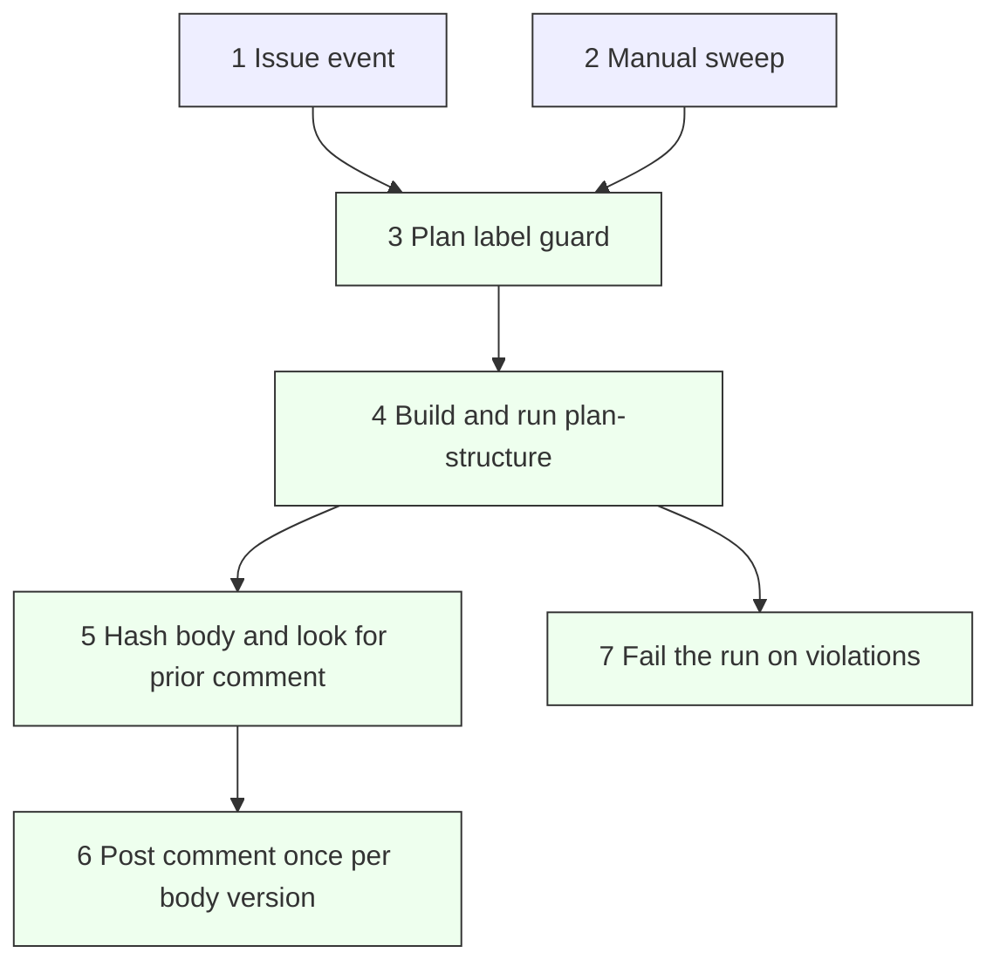
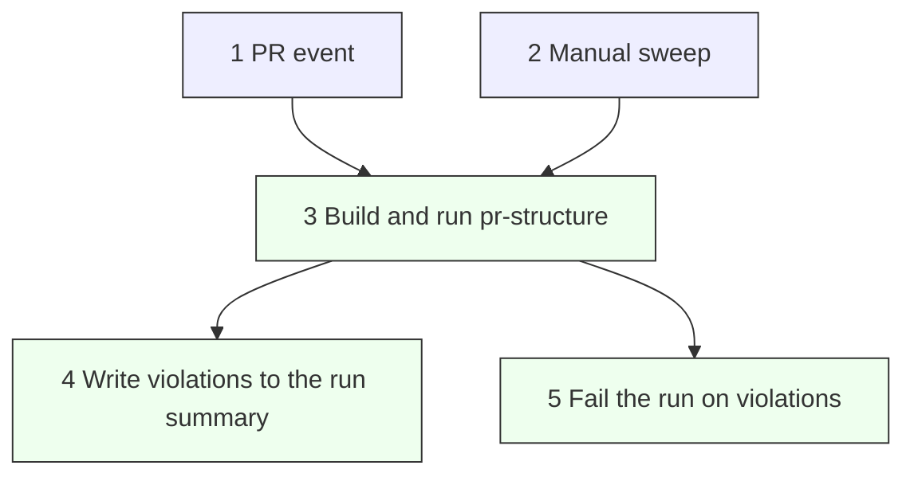

# Workflows

GitHub Actions workflows for this repo. The runner enforces the checks on commits; these workflows extend the same checks to places that are not files in the tree.

## plan-check

Plans live as GitHub Issues under the `Plan` label, so the file runner never sees them. [plan-check.yml](plan-check.yml) runs the `plan-structure` check on an Issue body and comments the result on the Issue.

| #   | Element      | Description                                                        | Why                                                       |
| --- | ------------ | ----------------------------------------------------------------- | --------------------------------------------------------- |
| 1   | Issue event  | An Issue is opened, edited, reopened, or labeled.                 | Validates a plan the moment its description changes.       |
| 2   | Manual sweep | A `workflow_dispatch` run walks every open `Plan` Issue.          | Backfills plans that predate the workflow.                 |
| 3   | Plan guard   | Issue-event runs proceed only when the Issue carries `Plan`.      | Other Issues are not plans and need no structure check.    |
| 4   | Run check    | Build `fitness-check-plan-structure` and feed it the body.        | One check binary, same rules as the local suite.           |
| 5   | Dedupe       | Hash the body and search the Issue for that hash marker.          | One comment per description version, never a duplicate.    |
| 6   | Comment      | Post a pass or fail comment carrying the hash marker.             | The result is visible where the plan lives.                |
| 7   | Fail run     | Exit non-zero when any validated Issue has violations.            | Surfaces the problem in the Actions run, not just a note.  |

## Triggers

- `issues` (`opened`, `edited`, `reopened`, `labeled`): validates that one Issue when it carries the `Plan` label.
- `workflow_dispatch`: sweeps every open `Plan` Issue and comments on each body version not seen before.

A changed description produces a new hash, so it earns a fresh comment while earlier comments stay as history.

## pr-check

A pull request description is not a file in the tree either, but a PR already has a status check surface. So unlike plan-check, [pr-check.yml](pr-check.yml) does not comment. It runs the `pr-structure` check on the PR body and writes any violations to the run summary. The run then fails, so the red check blocks the merge.

| #   | Element      | Description                                                  | Why                                                       |
| --- | ------------ | ----------------------------------------------------------- | --------------------------------------------------------- |
| 1   | PR event     | A PR is opened, edited, reopened, or synchronized.          | Validates a description the moment it changes.             |
| 2   | Manual sweep | A `workflow_dispatch` run walks every open PR.              | Audits every open description on demand.                   |
| 3   | Run check    | Build `fitness-check-pr-structure` and feed it the body.    | One check binary, same rules as the local suite.           |
| 4   | Summary      | Write each PR's result and its violations to the run summary. | The errors are visible on the run page, no thread noise.  |
| 5   | Fail run     | Exit non-zero when any validated PR has violations.         | A required status check blocks the merge, not just a note. |

## Triggers (pr-check)

- `pull_request` (`opened`, `edited`, `reopened`, `synchronize`): validates that one PR's description.
- `workflow_dispatch`: sweeps every open PR and reports each in the run summary.

Unlike plan-check there is no label guard and no comment. Every PR carries a description, so every PR is validated, and the status check is the verdict.
