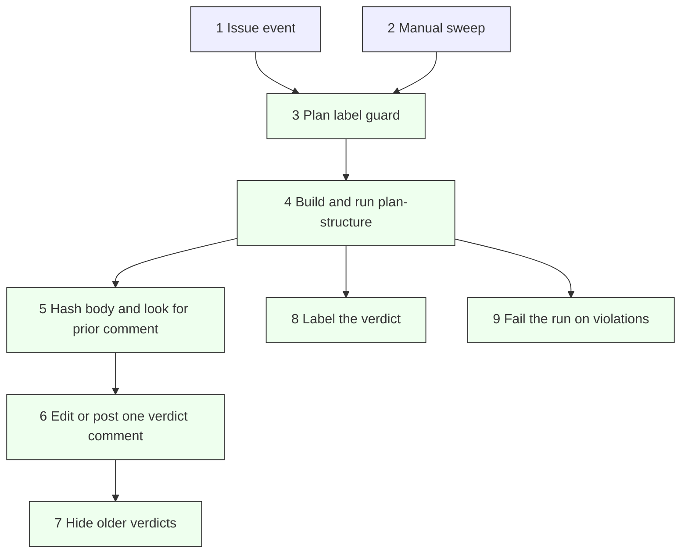
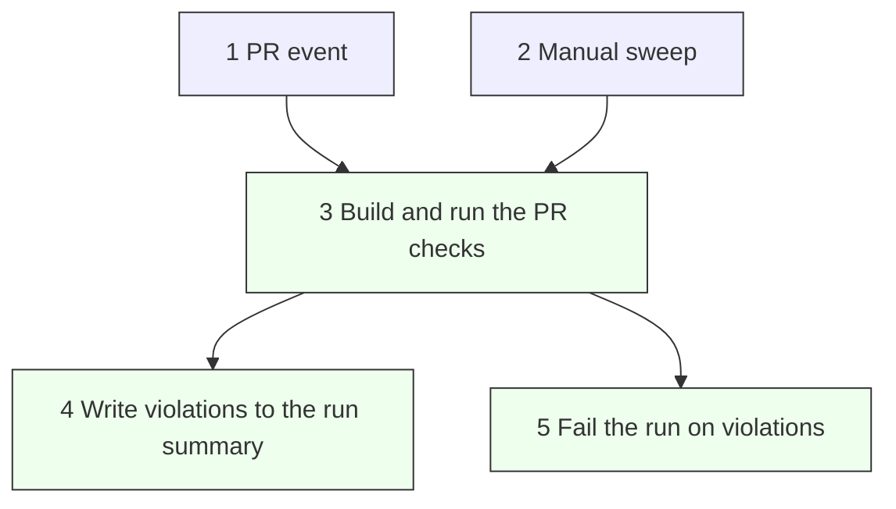
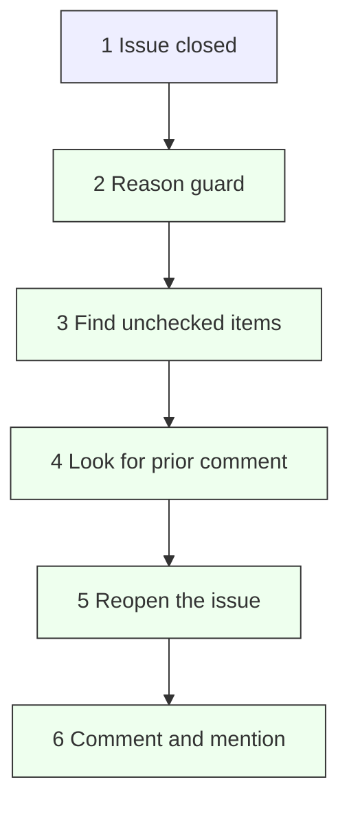

# Workflows

GitHub Actions workflows for this repo. The runner enforces the checks on commits; these workflows extend the same checks to places that are not files in the tree.

## plan-check

Plans live as GitHub Issues under the `Plan` label, so the file runner never sees them. [plan-check.yml](plan-check.yml) runs `fitness plan-check` to lint an Issue body. It keeps one live verdict comment and label on the Issue.

```mermaid
flowchart TD
    A[1 Issue event]:::trigger
    B[2 Manual sweep]:::trigger
    C[3 Plan label guard]:::step
    D[4 Build and run plan-structure]:::step
    E[5 Hash body and look for prior comment]:::step
    F[6 Edit or post one verdict comment]:::step
    G[7 Hide older verdicts]:::step
    H[8 Label the verdict]:::step
    I[9 Fail the run on violations]:::step
    A --> C
    B --> C
    C --> D
    D --> E
    E --> F
    F --> G
    D --> H
    D --> I
    classDef trigger fill:#eef,stroke:#333
    classDef step fill:#efe,stroke:#333
```

| #   | Element      | Description                                                        | Why                                                       |
| --- | ------------ | ----------------------------------------------------------------- | --------------------------------------------------------- |
| 1   | Issue event  | An Issue is opened, edited, reopened, or labeled.                 | Validates a plan the moment its description changes.       |
| 2   | Manual sweep | A `workflow_dispatch` run walks every open `Plan` Issue.          | Backfills plans that predate the workflow.                 |
| 3   | Plan guard   | Issue-event runs proceed only when the Issue carries `Plan`.      | Other Issues are not plans and need no structure check.    |
| 4   | Run check    | Build the checks and run `fitness plan-check` on the body.        | One tested binary, same rules as the local suite.          |
| 5   | Dedupe       | Hash the body and search the Issue for that hash marker.          | One comment per description version, never a duplicate.    |
| 6   | Comment      | A pass after a pass edits it to `✅ Validated`; else post anew. | One live verdict, no pile of repeats. |
| 7   | Hide         | Hide older bot verdicts as outdated.                              | Only the live verdict stays open.                          |
| 8   | Label        | Add `fitness` and `fitness-valid` or `fitness-invalid`.          | Issue lists show the verdict.                              |
| 9   | Fail run     | Exit non-zero when any validated Issue has violations.            | Surfaces the problem in the Actions run, not just a note.  |

## Triggers

- `issues` (`opened`, `edited`, `reopened`, `labeled`): validates that one Issue when it carries the `Plan` label.
- `workflow_dispatch`: sweeps every open `Plan` Issue and comments on each body version not seen before.

A changed description earns a new verdict; earlier ones stay hidden.

## pr-check

A PR description is not a file either, but a PR has a status check. So [pr-check.yml](pr-check.yml) does not comment. It runs `fitness pr-check` on the title and body and writes violations to the run summary. The run fails, so the red check blocks the merge.

```mermaid
flowchart TD
    A[1 PR event]:::trigger
    B[2 Manual sweep]:::trigger
    C[3 Build and run the PR checks]:::step
    D[4 Write violations to the run summary]:::step
    E[5 Fail the run on violations]:::step
    A --> C
    B --> C
    C --> D
    C --> E
    classDef trigger fill:#eef,stroke:#333
    classDef step fill:#efe,stroke:#333
```

| #   | Element      | Description                                                  | Why                                                       |
| --- | ------------ | ----------------------------------------------------------- | --------------------------------------------------------- |
| 1   | PR event     | A PR is opened, edited, reopened, or synchronized.          | Validates a description the moment it changes.             |
| 2   | Manual sweep | A `workflow_dispatch` run walks every open PR.              | Audits every open description on demand.                   |
| 3   | Run check    | Run `fitness pr-check`, which also reads each closed issue's checklist. | One tested binary, same rules as the local suite.     |
| 4   | Summary      | Write each PR's result and its violations to the run summary. | The errors are visible on the run page, no thread noise.  |
| 5   | Fail run     | Exit non-zero when any validated PR has violations.         | A required status check blocks the merge, not just a note. |

## Triggers (pr-check)

- `pull_request` (`opened`, `edited`, `reopened`, `synchronize`): validates that one PR's description.
- `workflow_dispatch`: sweeps every open PR and reports each in the run summary.

There is no label guard: every PR has a description, so every PR is validated, and the status check is the verdict.

## fitness-suite

A may-journal/.github ruleset injects [fitness-suite.yml](fitness-suite.yml) on every org pull request, as it does pr-check. It calls `ci-reusable`, with `swift` on when the repo has Swift files. It runs everywhere but fitness-runner, which builds checks from source.

## close-check

[close-check.yml](close-check.yml) runs `fitness close-check` when an issue closes, so unfinished work stays open. Other repos call [close-check-reusable.yml](close-check-reusable.yml).

```mermaid
flowchart TD
    A[1 Issue closed]:::trigger
    B[2 Reason guard]:::step
    C[3 Find unchecked items]:::step
    D[4 Look for prior comment]:::step
    E[5 Reopen the issue]:::step
    F[6 Comment and mention]:::step
    A --> B
    B --> C
    C --> D
    D --> E
    E --> F
    classDef trigger fill:#eef,stroke:#333
    classDef step fill:#efe,stroke:#333
```

| #   | Element        | Description                                                         | Why                                                   |
| --- | -------------- | ------------------------------------------------------------------ | ----------------------------------------------------- |
| 1   | Issue closed   | An `issues: closed` event, from a person or a PR keyword.          | Catches every close.                                  |
| 2   | Reason guard   | A not planned or duplicate close stops here.                       | Dropped work may stay unfinished.                     |
| 3   | Unchecked scan | List each `- [ ]` item, skipping any inside fenced code.           | Only real tasks count, not examples.                  |
| 4   | Dedupe         | Hash the close time and body, then look for that marker.           | A re-run never reopens or comments twice.             |
| 5   | Reopen         | Set the Issue back to open.                                        | Unfinished work stays visible.                        |
| 6   | Comment        | List the items and mention the closer, PR author, and merger.      | The closer hears why it came back.                    |

## auto-merge

[auto-merge.yml](auto-merge.yml) turns on squash auto-merge for ready pull requests in every org repo, as a required workflow. It lives here because public repos cannot run a private repo's workflows. It acts as the `may-journal-automation` App, so CI still runs on `main`.

may-journal/.github syncs [auto-merge-on-ready.yml](auto-merge-on-ready.yml) into each repo, so drafts marked ready get it.
