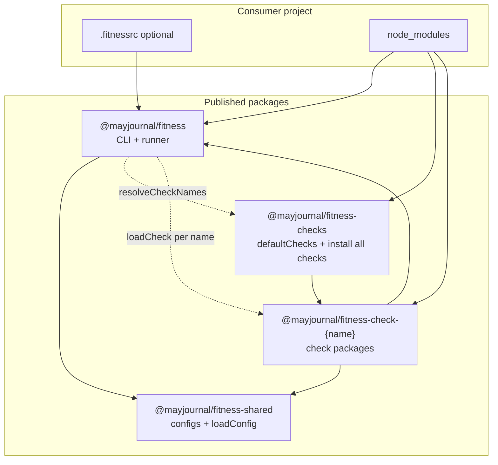
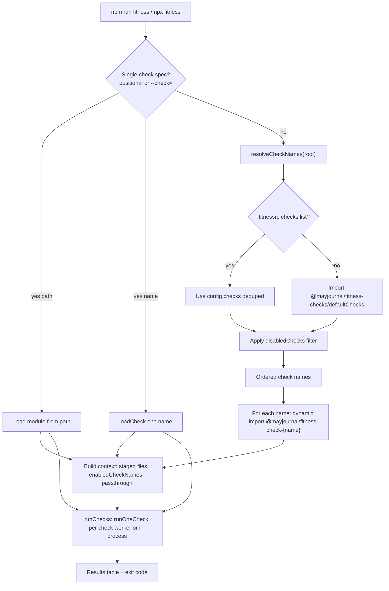

# Architecture

This repo is an npm workspaces monorepo: the runner orchestrates checks loaded from separate packages at runtime. There is no in-process check registry; resolution uses `.fitnessrc`, the checks bundle, and dynamic imports.

## Monorepo layout

```text
fitness-runner/
  package.json                 workspaces root
  packages/
    runner/                    @mayjournal/fitness
    shared/                    @mayjournal/fitness-shared
    checks-bundle/             @mayjournal/fitness-checks
    checks/
      eslint/                  @mayjournal/fitness-check-eslint
      prettier/                … one folder per check package
      semantic-commit/         …
```

Workspaces: `packages/runner`, `packages/shared`, `packages/checks-bundle`, `packages/checks/*`.

### Package relationships



| Package                            | Role                                                                                                                  |
| ---------------------------------- | --------------------------------------------------------------------------------------------------------------------- |
| `@mayjournal/fitness`              | CLI entry (`fitness`), `resolveCheckNames`, dynamic `loadCheck`, run loop, types (`Check`, `RunContext`, `CheckName`) |
| `@mayjournal/fitness-check-{name}` | One check per package; default export must be a `Check` whose `name` matches the package suffix                       |
| `@mayjournal/fitness-checks`       | Depends on all check packages; exports ordered `defaultChecks` (subpath `@mayjournal/fitness-checks/defaultChecks`)   |
| `@mayjournal/fitness-shared`       | Shared configs (eslint, prettier, vitest, tsconfig, cspell), `loadConfig` for `.fitnessrc`, utilities used by checks  |

## Runtime flow

End-to-end path from `npm run fitness` through resolution, load, and execution.



### Resolve check names (priority)

`resolveCheckNames` in `packages/runner/src/checks/load-check.ts` produces one ordered, deduped list:

1. `.fitnessrc` present with `checks` — use that list (order preserved, duplicates dropped).
2. No `checks` list — import `defaultChecks` from `@mayjournal/fitness-checks/defaultChecks`.
3. `disabledChecks` in config — remove those names from the list from step 1 or 2.
4. Neither step 1 nor 2 available — throw with a clear message: install `@mayjournal/fitness-checks` or set `checks` in `.fitnessrc` and install matching `@mayjournal/fitness-check-*` packages.

There is no separate registry step and no silent skip when a configured check package is missing (unless `.fitnessrc` listed checks and `tryLoadCheck` is used for optional names).

### Load and run

For each resolved name:

```ts
const pkg = `@mayjournal/fitness-check-${name}`;
const check = (await import(resolvedPath)).default;
// throws if package missing or default.name !== name
await check.run(root, context);
```

Single-check mode bypasses the list: `npx fitness prettier`, `npx fitness --check=eslint`, or `npx fitness --check=./my-check.mjs`.

Context fields come from loaded checks and the runner, not a registry:

| Field                  | Source                                                        |
| ---------------------- | ------------------------------------------------------------- |
| `enabledCheckNames`    | names in this run                                             |
| `registeredCheckNames` | same as enabled                                               |
| `checkFolderByName`    | each loaded `Check.folder` when set                           |
| `stagedFiles`          | `git diff --cached --name-only` (node_modules paths stripped) |
| `passthroughArgs`      | args after check spec for single-check runs                   |

Execution (`packages/runner/src/runner/run-execute.ts`): most npm checks run in a worker thread with a timeout; path-loaded checks and a few built-ins run in-process.

## Check packages

Each check is one npm package: `@mayjournal/fitness-check-{name}` with a matching `Check.name`, under `packages/checks/<name>/` (implementation, tests, README). Examples: `eslint`, `prettier`, `semantic-commit`.

When no `.fitnessrc` `checks` list is set, run order comes from `defaultChecks` in [packages/checks-bundle/src/index.ts](./packages/checks-bundle/src/index.ts) (published as `@mayjournal/fitness-checks/defaultChecks`). Tool-specific config files ship with the check that uses them.

## Consumer setup

| Setup                                                | Config                              | What runs                                           |
| ---------------------------------------------------- | ----------------------------------- | --------------------------------------------------- |
| `@mayjournal/fitness` + `@mayjournal/fitness-checks` | None                                | Bundle `defaultChecks` in order                     |
| Above + `.fitnessrc` with `checks`                   | Override list                       | Your `checks` order and subset                      |
| Above + `.fitnessrc` with `disabledChecks` only      | Exclude names                       | Bundle list minus disabled                          |
| `@mayjournal/fitness` + à la carte check packages    | Required `.fitnessrc` with `checks` | Only listed checks (each package must be installed) |

Simplest path: install runner and bundle, add `"fitness": "fitness"` script, run with no `.fitnessrc`.

Example override:

```ts
// .fitnessrc.ts
export default {
  checks: ['eslint', 'prettier', 'semantic-commit'],
  disabledChecks: ['cspell'], // excluded from checks list above, or from bundle defaultChecks when checks is omitted
};
```

Install and usage details: [README.md](./README.md).

## Development in this repo

Root `package.json` uses workspace dependencies on `@mayjournal/fitness` and `@mayjournal/fitness-checks`. Scripts delegate to the runner workspace (`npm run fitness` → runner package). This repo may omit `.fitnessrc` to exercise the bundle default path.

Build and test: `npm run build -ws`, `npm run test -w @mayjournal/fitness`, `npm run fitness`.

Further implementation notes: [plans/archive/plan-split-runner-check-packages.md](./plans/archive/plan-split-runner-check-packages.md).
