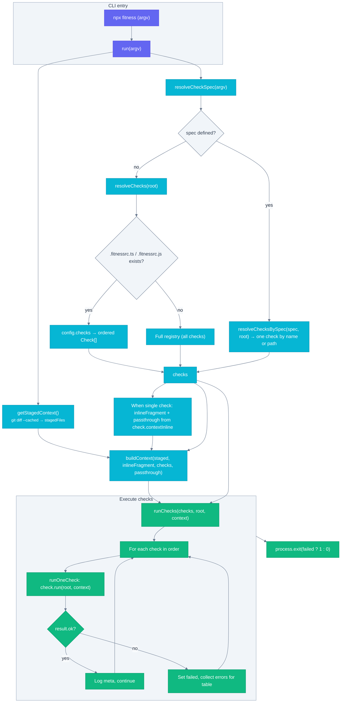

---
# Top-level project config
relatedConfigurations: ['package.json']
---

# @fitness/runner

Node fitness runner that runs checks for local dev, CI/CD, and GenAI workflows to stay aligned with your intended rules and quality bar.

## Install

```bash
npm install @fitness/runner
```

## Usage

CLI (from repo root):

```bash
npx fitness
```

Run a single check by name (positional or flag; use `--` before flags if npx swallows them):

```bash
npx fitness prettier
npx fitness prettier --write .
# or
npx fitness semantic-commit
# or
npx fitness --check=semantic-commit
```

Checks can register `contextInline` so the runner injects a named arg value into context and strips it from passthrough. For the commit-msg hook with semantic-commit, pass the message string: `fitness --check=semantic-commit --message="$(cat "$1")"`. See each check’s README for its arg name.

## Checks

See [src/checks/README.md](src/checks/README.md) for the list and how checks work. Each check has its own README:

- [read-repo-first](src/checks/read-repo-first/README.md)
- [changelog](src/checks/changelog/README.md)
- [changelog-updated](src/checks/changelog-updated/README.md)
- [cspell](src/checks/cspell/README.md)
- [eslint](src/checks/eslint/README.md)
- [markdown-no-bold-italic](src/checks/markdown-no-bold-italic/README.md)
- [prettier](src/checks/prettier/README.md)
- [node-version](src/checks/node-version/README.md)
- [rules-front-matter](src/checks/rules-front-matter/README.md)
- [semantic-commit](src/checks/semantic-commit/README.md)
- [vitest-coverage-exclude](src/checks/vitest-coverage-exclude/README.md)

## Exported configs

Consumers can extend these configs via package exports:

- `@fitness/runner/eslint.config` – ESLint flat config
- `@fitness/runner/vitest.config` – Vitest
- `@fitness/runner/tsconfig` – TypeScript
- `@fitness/runner/cspell` – cspell.json
- `@fitness/runner/prettier.config` – Prettier (semi, singleQuote, tabWidth 2, trailingComma es5, printWidth 100, sort-json for JSON keys); ESLint sort-keys enforces alphabetical object keys in TS/JS/CJS

Example: add `"prettier": "@fitness/runner/prettier.config"` to your package.json to use the shared Prettier config.

## Config

Optional `.fitnessrc.ts` or `.fitnessrc.js` at repo root:

```ts
export default {
  checks: ['changelog', 'node-version', 'semantic-commit'], // run these checks, in order
};
```

If present, only listed checks run; if omitted, all checks run. Use `.fitnessrc.js` with `module.exports = { checks: [...] }` for plain Node.

## Checks as sub-projects

Each check lives in `src/checks/<name>/` with its implementation, tests, and a README. They are designed to be code-split and a main contribution surface—see [src/checks/README.md](src/checks/README.md) and each check’s folder for behavior and how to add or extend checks.

## Development

```bash
npm install
npm run build
npm run fitness
npm run format
npm run lint
npm test
```

## Code flow and check process


