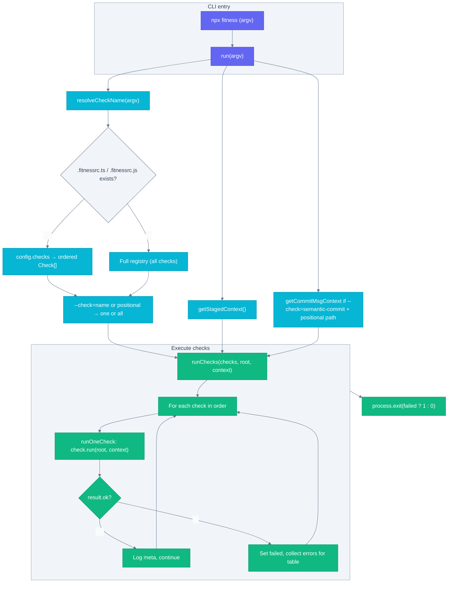

---
# Top-level project config
relatedConfigurations: ["package.json"]
---

# @fitness/runner

Node fitness runner that runs checks for local dev, CI/CD, and GenAI workflows to stay aligned with your intended rules and quality bar.

## Install

```bash
npm install @fitness/runner
```

## Usage

CLI (from repo root):

```bash
npx fitness
```

Run a single check by name (positional or flag; use `--` before flags if npx swallows them):

```bash
npx fitness semantic-commit
# or
npx fitness --check=semantic-commit
```

Commit-msg hook: pass the message file as a positional so semantic-commit validates the proposed message: `fitness --check=semantic-commit "$1"`.

## Checks

See [src/checks/README.md](src/checks/README.md) for the list and how checks work. Each check has its own README:

- [changelog](src/checks/changelog/README.md)
- [changelog-updated](src/checks/changelog-updated/README.md)
- [cspell](src/checks/cspell/README.md)
- [node-version](src/checks/node-version/README.md)
- [rules-front-matter](src/checks/rules-front-matter/)
- [semantic-commit](src/checks/semantic-commit/README.md)

## Config

Optional `.fitnessrc.ts` or `.fitnessrc.js` at repo root:

```ts
export default {
  checks: ['changelog', 'node-version', 'semantic-commit'], // run these checks, in order
};
```

If present, only listed checks run; if omitted, all checks run. Use `.fitnessrc.js` with `module.exports = { checks: [...] }` for plain Node.

## Checks as sub-projects

Each check lives in `src/checks/<name>/` with its implementation, tests, and a README. They are designed to be code-split and a main contribution surface—see [src/checks/README.md](src/checks/README.md) and each check’s folder for behavior and how to add or extend checks.

## Development

```bash
npm install
npm run build
npm run fitness
npm test
```

## Code flow and check process


