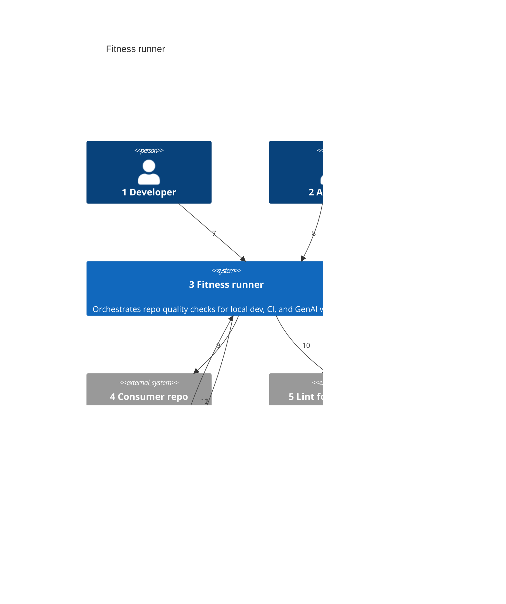
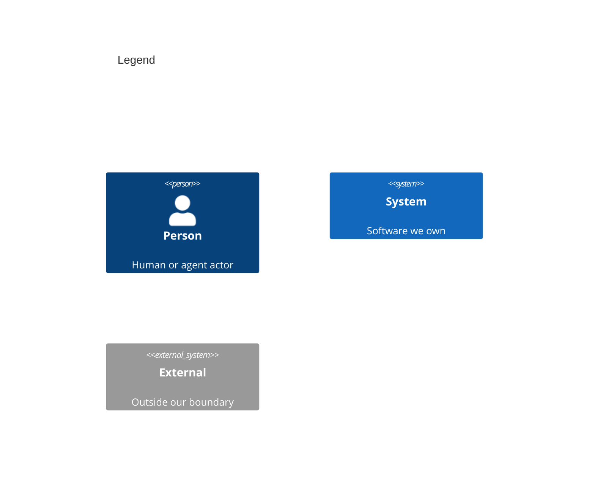

# System Context

Numbers on nodes and arrows match the callout table.

| #   | Description                                                                                           | Why                                                                 |
| --- | ----------------------------------------------------------------------------------------------------- | ------------------------------------------------------------------- |
| 1   | Runs `fitness`, git hooks, or single checks locally.                                          | Primary operator; same bar as CI.                                   |
| 2   | Cursor, Claude Code, or other agents triggered to run fitness before/after edits.                     | GenAI workflows share the runner — see [wardley.md](../wardley.md). |
| 3   | Static Go binaries (runner + 27 checks) plus one npm config package.                                  | The product boundary — self-contained executables.                  |
| 4   | Any repo with the binaries on PATH; may author local check executables.                               | Runner always executes in the consumer's working directory.         |
| 5   | Commodity linters, formatters, test runners, and git.                                                 | Checks wrap these; runner does not replace them.                    |
| 6   | Pipeline that runs fitness on push or PR.                                                             | Cloud enforcement of the same check list.                           |
| 7   | Local dev and optional git hooks.                                                                     | Fast feedback before commit.                                        |
| 8   | Agent skills, rules, or hooks invoke the same CLI.                                                    | Closes local vs agent drift when wired.                             |
| 9   | Reads staged files, source tree, config, and optional local check executables from the consumer repo. | The working directory is the app root, not the runner repo.         |
| 10  | Tool-wrapper checks exec the underlying CLIs; native engines need none.                               | Orchestration, not reimplementation.                                |
| 11  | CI builds or downloads the binaries and runs `fitness`.                                               | Same command as local.                                              |
| 12  | Non-zero exit fails the pipeline.                                                                     | Pass/fail is deterministic, not LLM-judged.                         |
