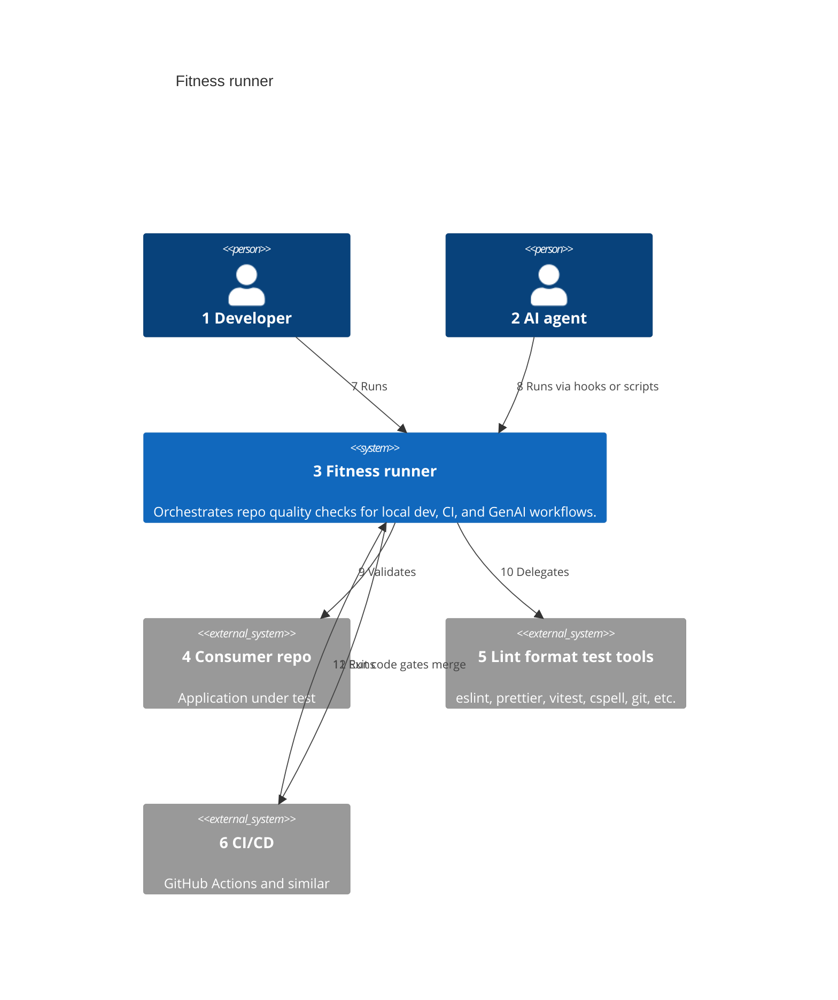
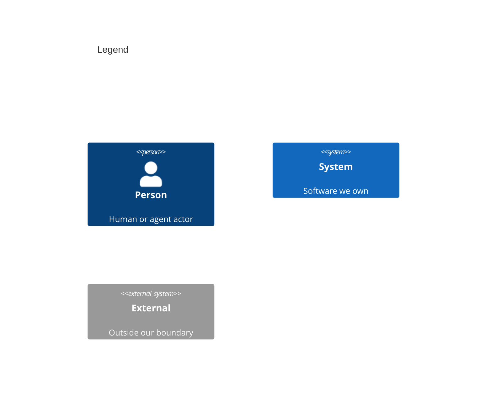

# System Context

Numbers on nodes and arrows match the callout table.

| #   | Description                                                                       | Why                                                                 |
| --- | --------------------------------------------------------------------------------- | ------------------------------------------------------------------- |
| 1   | Runs `npm run fitness`, git hooks, or single checks locally.                      | Primary operator; same bar as CI.                                   |
| 2   | Cursor, Claude Code, or other agents triggered to run fitness before/after edits. | GenAI workflows share the runner — see [Wardley.md](../Wardley.md). |
| 3   | Published npm packages: CLI, check packages, bundle, shared configs.              | The product boundary — not one monolith binary.                     |
| 4   | Any repo that installs `@mayjournal/fitness` and check packages.                  | Runner always executes in the consumer's working directory.         |
| 5   | Commodity linters, formatters, test runners, and git.                             | Checks wrap these; runner does not replace them.                    |
| 6   | Pipeline that runs fitness on push or PR.                                         | Cloud enforcement of the same check list.                           |
| 7   | Local dev and optional git hooks.                                                 | Fast feedback before commit.                                        |
| 8   | Agent skills, rules, or hooks invoke the same CLI.                                | Closes local vs agent drift when wired.                             |
| 9   | Reads staged files, source tree, and config from the consumer repo.               | `process.cwd()` is the app root, not the runner repo.               |
| 10  | Each check package calls the underlying tool APIs or CLIs.                        | Orchestration, not reimplementation.                                |
| 11  | CI installs npm deps and runs `fitness` or `npm run fitness`.                     | Same command as local.                                              |
| 12  | Non-zero exit fails the pipeline.                                                 | Pass/fail is deterministic, not LLM-judged.                         |
