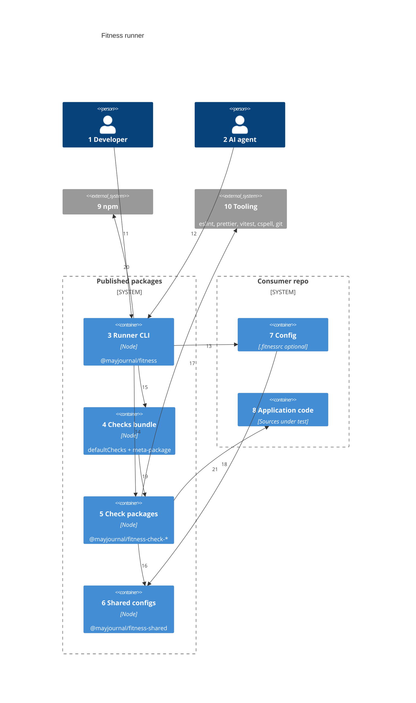
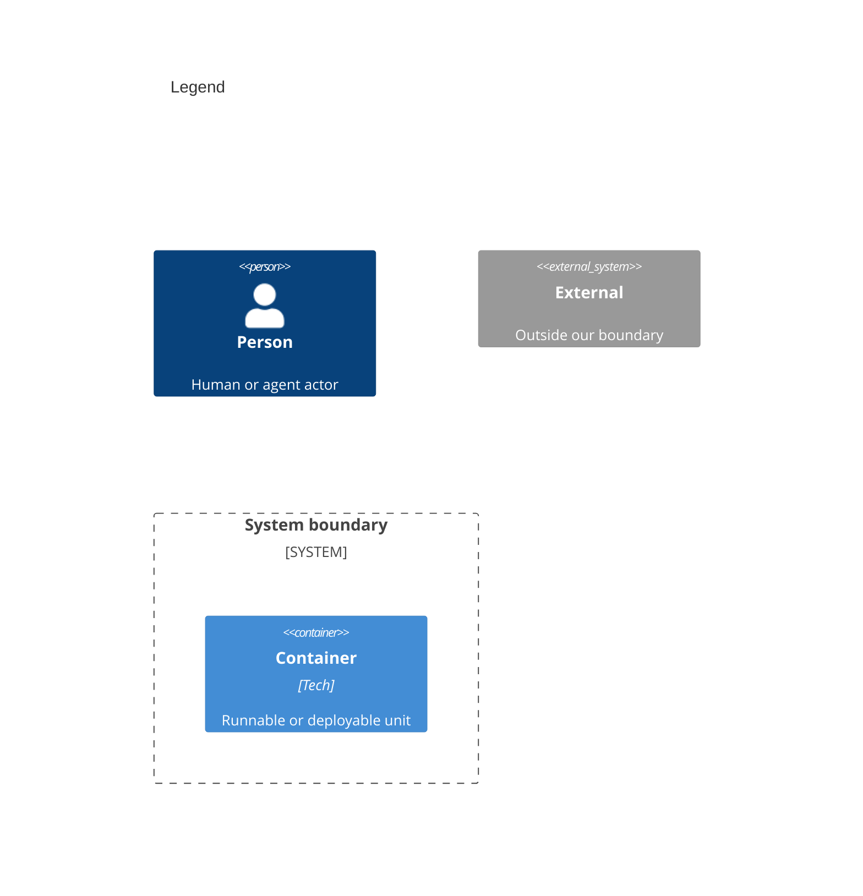

# Containers

Numbers on nodes and arrows match the callout table.

| #   | Description                                                                        | Why                                                      |
| --- | ---------------------------------------------------------------------------------- | -------------------------------------------------------- |
| 1   | Same actor as system context.                                                      | All runs start at the CLI.                               |
| 2   | Same agent actor as system context.                                                | Agents never load checks directly — they invoke the CLI. |
| 3   | Entry `fitness`, resolve names, dynamic import, run loop, results table.           | Single orchestration surface.                            |
| 4   | `@mayjournal/fitness-checks` — depends on all checks; exports `defaultChecks`.     | Default path when `.fitnessrc` omits `checks`.           |
| 5   | One npm package per check under `packages/checks/<name>/`.                         | Plugin model; no in-process registry.                    |
| 6   | eslint, prettier, vitest, tsconfig, cspell configs; `loadConfig` for `.fitnessrc`. | Opinionated defaults; consumer local config wins.        |
| 7   | Optional `.fitnessrc.ts` / `.fitnessrc.js` — `checks`, `disabledChecks`.           | Override order and subset without forking checks.        |
| 8   | Files checks lint, format, spell-check, or test.                                   | Staged paths from git when available.                    |
| 9   | Dynamic `import()` of check packages from consumer `node_modules`.                 | Checks are normal npm dependencies.                      |
| 10  | Underlying tools invoked by check implementations.                                 | Commodity layer on the Wardley map.                      |
| 11  | Developer runs CLI from consumer root.                                             | One front door.                                          |
| 12  | Agent runs the same CLI via script or hook.                                        | Unified enforcement path.                                |
| 13  | Runner loads config via `@mayjournal/fitness-shared`.                              | Centralizes config discovery.                            |
| 14  | Runner imports `@mayjournal/fitness-check-{name}` per resolved name.               | Runtime loading — not a static registry in the runner.   |
| 15  | When no `checks` list, imports `@mayjournal/fitness-checks/defaultChecks`.         | Bundle defines default run order.                        |
| 16  | Checks import shared configs and utilities.                                        | Avoid duplicating eslint/prettier setup per check.       |
| 17  | Check `run()` calls tool APIs or subprocesses.                                     | Check owns tool-specific behavior.                       |
| 18  | Checks read consumer tree (staged or full).                                        | Validation target is always the app repo.                |
| 19  | Bundle package.json depends on every check package.                                | Install once for full suite.                             |
| 20  | Package resolution walks up to nearest install root.                               | Monorepos and nested packages supported.                 |
| 21  | Shared loader reads `.fitnessrc` from consumer root.                               | Config lives with the app, not the runner source.        |

## Consumer setup

| Setup                                                | Config                              | What runs                                   |
| ---------------------------------------------------- | ----------------------------------- | ------------------------------------------- |
| `@mayjournal/fitness` + `@mayjournal/fitness-checks` | None                                | Bundle `defaultChecks` in order             |
| Above + `.fitnessrc` with `checks`                   | Override list                       | Your `checks` order and subset              |
| Above + `.fitnessrc` with `disabledChecks` only      | Exclude names                       | Bundle list minus disabled                  |
| `@mayjournal/fitness` + à la carte check packages    | Required `.fitnessrc` with `checks` | Only listed checks (each must be installed) |

Install and usage: [README.md](../README.md).
