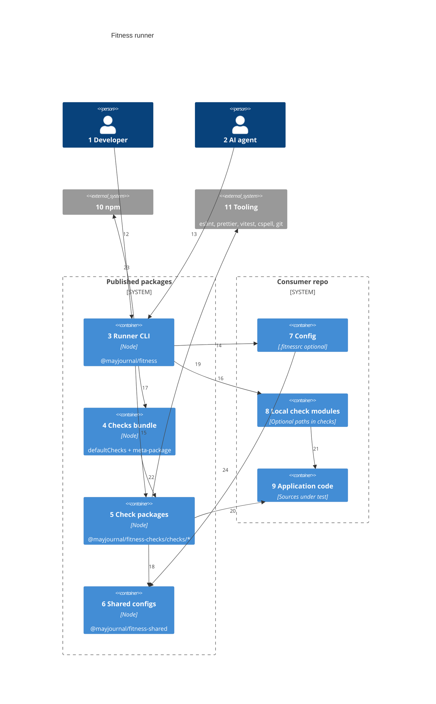
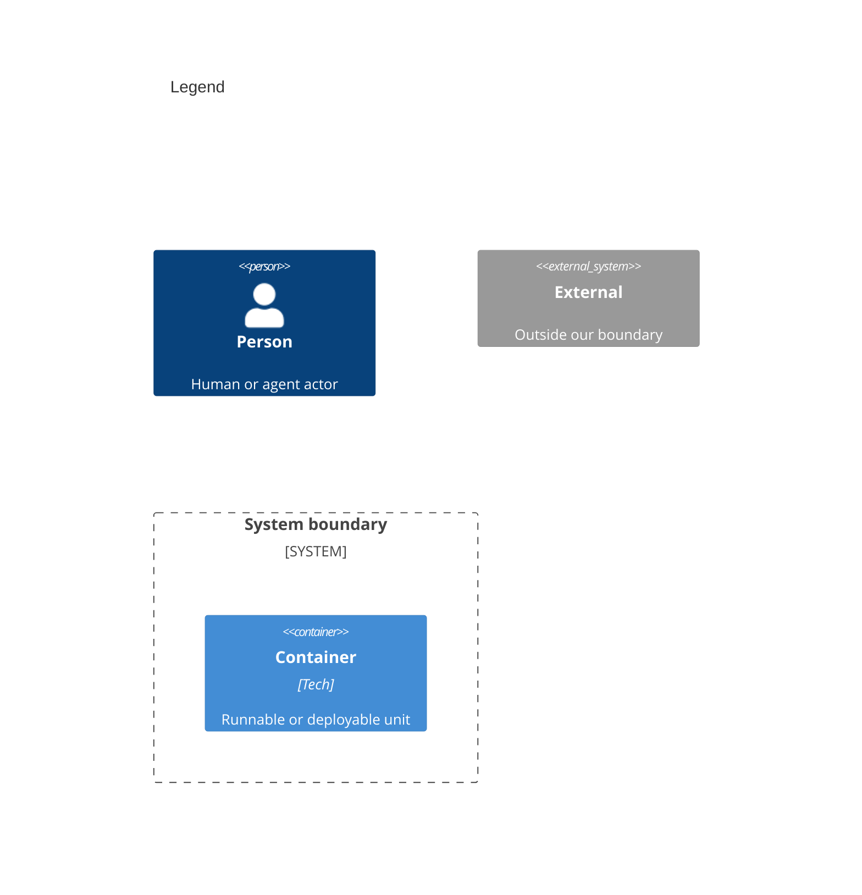

# Containers

Numbers on nodes and arrows match the callout table.

| #   | Description                                                                                                                                                                | Why                                                                              |
| --- | -------------------------------------------------------------------------------------------------------------------------------------------------------------------------- | -------------------------------------------------------------------------------- |
| 1   | Same actor as system context.                                                                                                                                              | All runs start at the CLI.                                                       |
| 2   | Same agent actor as system context.                                                                                                                                        | Agents never load checks directly — they invoke the CLI.                         |
| 3   | Entry `fitness`, resolve check specs, dynamic import, run loop, results table.                                                                                             | Single orchestration surface.                                                    |
| 4   | `@mayjournal/fitness-checks` — depends on all checks; exports `defaultChecks`.                                                                                             | Default path when `.fitnessrc` omits `checks`.                                   |
| 5   | One workspace per check under `packages/checks/<name>/`; loaded via `@mayjournal/fitness-checks/checks/<name>` (the per-check package itself is private, never published). | Plugin model; no in-process registry.                                            |
| 6   | eslint, prettier, vitest, tsconfig, cspell configs; `loadConfig` for `.fitnessrc`.                                                                                         | Opinionated defaults; consumer local config wins.                                |
| 7   | Optional `.fitnessrc.ts` / `.fitnessrc.js` — `checks` (names and/or paths), `disabledChecks`.                                                                              | Override order and subset; paths opt in explicitly.                              |
| 8   | Consumer-authored check modules (e.g. `./fitness/checks/*.js`) referenced from `.fitnessrc`.                                                                               | Repo-specific rules without adding a dependency on `@mayjournal/fitness-checks`. |
| 9   | Files checks lint, format, spell-check, or test.                                                                                                                           | Staged paths from git when available.                                            |
| 10  | Dynamic `import()` of check packages from consumer `node_modules`.                                                                                                         | Published checks are normal npm dependencies.                                    |
| 11  | Underlying tools invoked by check implementations.                                                                                                                         | Commodity layer on the Wardley map.                                              |
| 12  | Developer runs CLI from consumer root.                                                                                                                                     | One front door.                                                                  |
| 13  | Agent runs the same CLI via script or hook.                                                                                                                                | Unified enforcement path.                                                        |
| 14  | Runner loads config via `@mayjournal/fitness-shared`.                                                                                                                      | Centralizes config discovery.                                                    |
| 15  | Runner imports the `@mayjournal/fitness-checks/checks/{name}` subpath for name specs.                                                                                      | Runtime loading — not a static registry in the runner.                           |
| 16  | Runner dynamic-imports local modules for path specs in `checks`.                                                                                                           | Same path rules as CLI; runs in-process, not in a worker.                        |
| 17  | When no `checks` list, imports `@mayjournal/fitness-checks/defaultChecks`.                                                                                                 | Bundle defines default run order.                                                |
| 18  | Checks import shared configs and utilities.                                                                                                                                | Avoid duplicating eslint/prettier setup per check.                               |
| 19  | Check `run()` calls tool APIs or subprocesses.                                                                                                                             | Check owns tool-specific behavior.                                               |
| 20  | Checks read consumer tree (staged or full).                                                                                                                                | Validation target is always the app repo.                                        |
| 21  | Local checks live beside app code; default-export a `Check`.                                                                                                               | Same `{ name, run }` contract as npm check packages.                             |
| 22  | Bundle package.json depends on every check package.                                                                                                                        | Install once for full suite.                                                     |
| 23  | Package resolution walks up to nearest install root.                                                                                                                       | Monorepos and nested packages supported.                                         |
| 24  | Shared loader reads `.fitnessrc` from consumer root.                                                                                                                       | Config lives with the app, not the runner source.                                |

## Consumer setup

| Setup                                                | Config                          | What runs                                        |
| ---------------------------------------------------- | ------------------------------- | ------------------------------------------------ |
| `@mayjournal/fitness` + `@mayjournal/fitness-checks` | None                            | Bundle `defaultChecks` in order                  |
| Above + `.fitnessrc` with `checks` (names only)      | Override list                   | Your `checks` order and subset                   |
| Above + `.fitnessrc` with `checks` (names + paths)   | Mixed npm names and local paths | Full configured list in order; paths in-process  |
| Above + `.fitnessrc` with `disabledChecks` only      | Exclude names                   | Bundle list minus disabled                       |
| `@mayjournal/fitness` + `checks` as local paths only | No `@mayjournal/fitness-checks` | Only your local check modules; no bundle install |

All name specs resolve through the installed `@mayjournal/fitness-checks` bundle — there is no separate per-check npm install today. `disabledChecks` applies to npm check names only; local paths are opt-in via explicit `checks` entries and are never removed by it.

`jscpd` is a `defaultChecks` member (bundled dependency, no extra install). `swiftlint` is opt-in only, never in `defaultChecks` — it shells out to a system binary, not an npm package, so a missing install fails clearly rather than crashing.

Install and usage: [README.md](../README.md).
