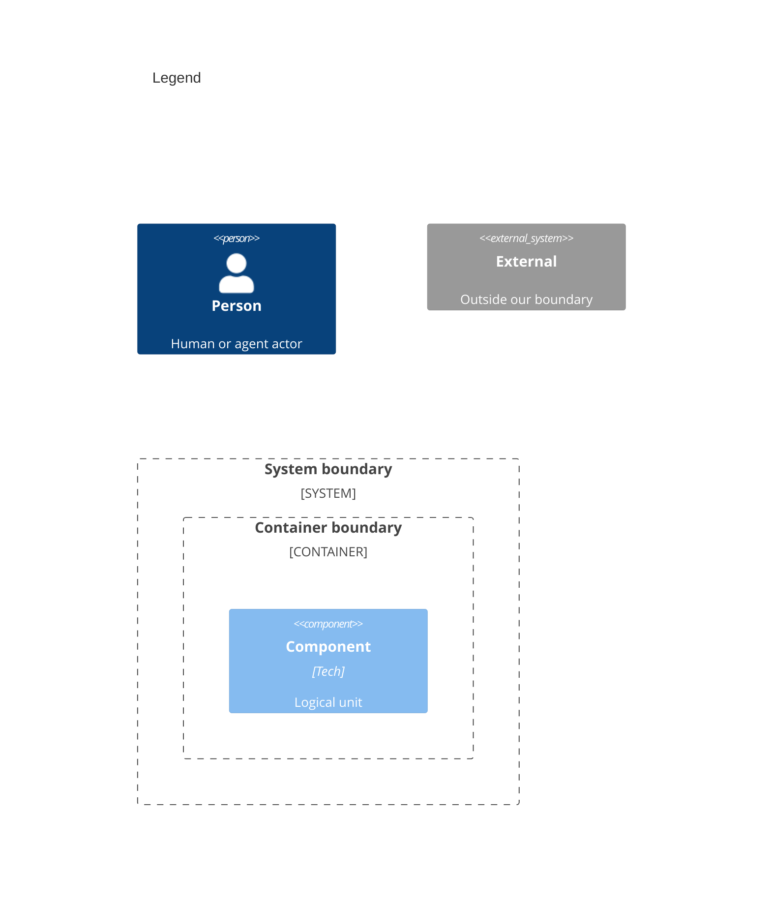

# Components

Numbers on nodes and arrows match the callout table.

| #   | Description                                                                                             | Why                                                         |
| --- | ------------------------------------------------------------------------------------------------------- | ----------------------------------------------------------- |
| 1   | Developer or agent invokes `fitness`.                                                                   | Same entry as system context.                               |
| 2   | `go/cmd/fitness/main.go` — argv, resolve, execute, render in one static binary.                         | No build step, no interpreter startup.                      |
| 3   | Loads `.fitnessrc.json` (stdlib encoding/json); a lone legacy JS/TS config earns a migration hint.      | Config a compiled runner can parse anywhere.                |
| 4   | Ordered check list: config `checks` else the embedded default list; disabled names removed; deduped.    | One place for spec resolution (name, path, full list).      |
| 5   | Bounded goroutine pool with per-check timeouts; expiry kills the check's whole process group.           | Parallelism bounds wall-clock at the slowest check.         |
| 6   | Renders the results table + totals line from collected outcomes, in dispatch order.                     | User-visible pass/fail summary.                             |
| 7   | One static binary per check name, discovered beside the runner then on PATH.                            | Plugin model at the artifact level; no registry.            |
| 8   | `checkkit` defines the protocol types and main scaffolding; walker, git, markdown, render helpers.      | One implementation shared by every check binary.            |
| 9   | Tool-wrapper checks exec the real peer tool from `node_modules/.bin` (walking up) then PATH, never npx. | Orchestration, not reimplementation.                        |
| 10  | `git diff --cached --name-only` for staged file context.                                                | Pre-commit and partial runs.                                |
| 11  | User-facing invocation.                                                                                 | Sole human entry point; all else is internal wiring.        |
| 12  | Entry loads config before argv resolution.                                                              | `.fitnessrc.json` drives order, subset, and options.        |
| 13  | Entry delegates to the resolver first.                                                                  | Resolve before execute.                                     |
| 14  | Resolver maps a name to the `fitness-check-<name>` binary and collects its `--describe` metadata.       | Timeout and context-inline metadata without header parsing. |
| 15  | Check binaries build on checkkit for protocol emit and env context.                                     | Contract every check satisfies.                             |
| 16  | Tool wrappers exec their peer binary and parse its output.                                              | The check owns tool invocation and judgment.                |
| 17  | Runner exports `FITNESS_STAGED_FILES` before dispatch.                                                  | Checks receive consistent context.                          |
| 18  | Run loop dispatches each check to the pool.                                                             | Ordered dispatch; buffered, ordered output.                 |
| 19  | Pool execs the binary with `--root`, env context, stdout JSON captured.                                 | One execution model for every check.                        |
| 20  | Run loop prints the table after all checks finish.                                                      | Single summary per invocation.                              |
| 21  | Consumer executable speaking the same protocol — a shell script works.                                  | Repo-specific checks without publishing anything.           |
| 22  | Resolver takes path specs (entries containing a separator) relative to the repo root.                   | Config and CLI share one code path.                         |
| 23  | Local checks run exactly like bundled ones.                                                             | No special cases in the engine.                             |

## Resolve check specs (priority)

`go/cmd/fitness` produces an ordered spec list, then resolves each entry to a binary:

1. `.fitnessrc.json` with `checks` — use that list (order preserved). Name specs resolve to `fitness-check-<name>` beside the runner, then on PATH; unknown names are skipped silently. Path specs (entries containing a separator) resolve relative to the repo root and fail the run when missing or not executable.
2. No `checks` — the runner's embedded default list; a missing binary for a default name fails the run.
3. `disabledChecks` — remove matching name specs from step 1 or 2. Path specs are unchanged (opt-in only).

Dedupe is first-occurrence-wins by resolved check name; a path check's name comes from its `--describe` metadata, else its basename.

Single-check mode bypasses the list: `fitness prettier`, `fitness --check=eslint`, or `fitness --check=./my-check`. Passthrough args after the spec reach the check; a check whose `--describe` declares a context-inline argument (the commit checks declare `--message`) has that value extracted into the environment and stripped from passthrough.

## Run context (environment)

| Variable                 | Source                                      |
| ------------------------ | ------------------------------------------- |
| `FITNESS_CHECK_NAME`     | resolved name of the running check          |
| `FITNESS_ENABLED_CHECKS` | names in this run, newline-separated        |
| `FITNESS_STAGED_FILES`   | git staged paths (node_modules stripped)    |
| `FITNESS_CTX_MESSAGE`    | `--message` value for context-inline checks |

Built by the runner before dispatch — not a separate registry.
