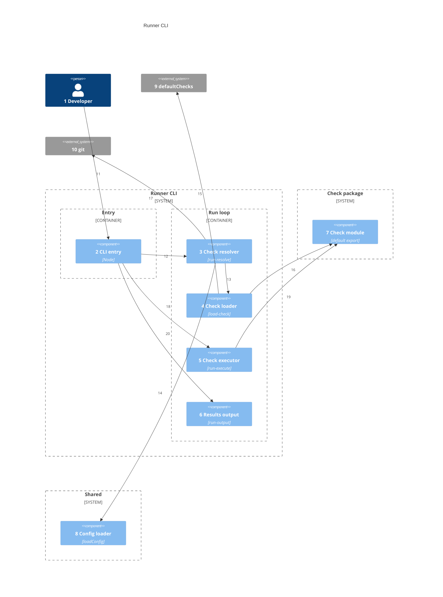
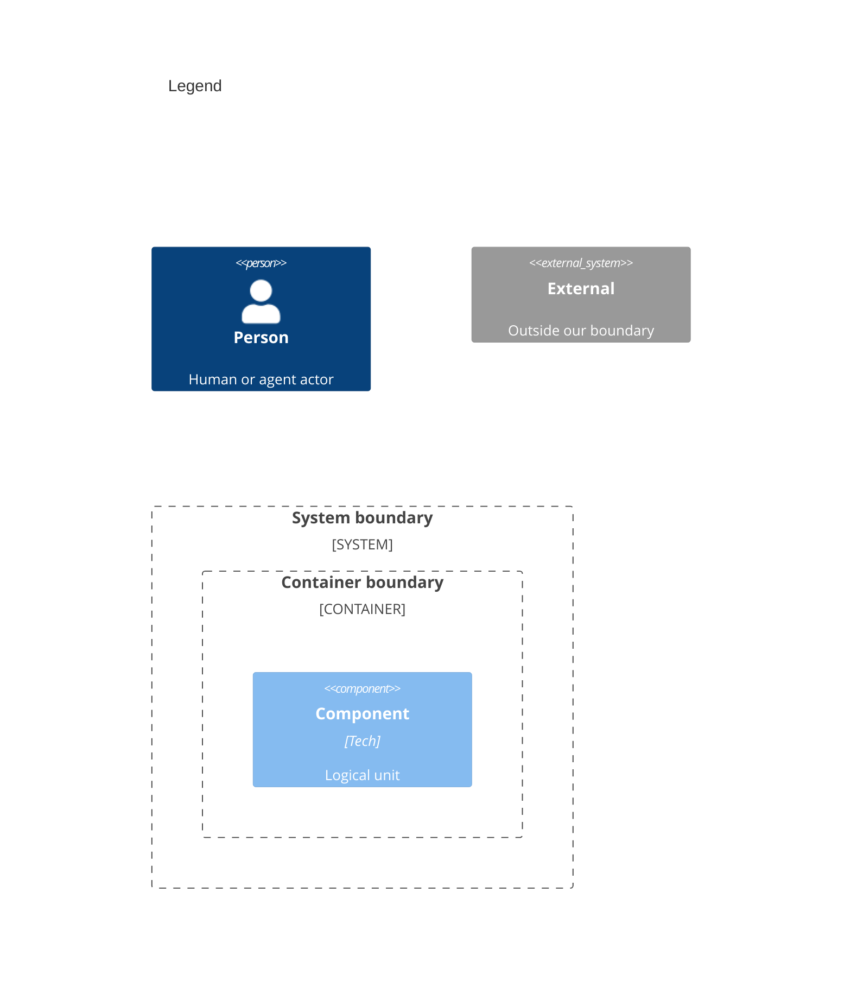

# Components

Numbers on nodes and arrows match the callout table.

| #   | Description                                                             | Why                                                       |
| --- | ----------------------------------------------------------------------- | --------------------------------------------------------- |
| 1   | Developer or agent invokes `fitness`.                                   | Same entry as system context.                             |
| 2   | `packages/runner/src/index.ts` — calls `run()` when main module.        | Thin entry; logic lives in runner modules.                |
| 3   | `getChecks` — argv parsing, single-check mode, context assembly.        | One place for spec resolution (name, path, full list).    |
| 4   | `resolveCheckNames`, `loadCheck`, `tryLoadCheck`, dynamic import.       | No static registry; names → npm packages.                 |
| 5   | `runOneCheck` — worker thread or in-process with timeout.               | Isolates slow checks; path-loaded checks stay in-process. |
| 6   | Results table, totals, chalk formatting, exit code.                     | User-visible pass/fail summary.                           |
| 7   | Each check's `Check` default export — `name`, `run()`.                  | Contract every package must satisfy.                      |
| 8   | Reads `.fitnessrc` and merges with bundle defaults.                     | Shared between resolver and loader.                       |
| 9   | `@mayjournal/fitness-checks/defaultChecks` when config has no `checks`. | Ordered default list.                                     |
| 10  | `git diff --cached --name-only` for staged file context.                | Pre-commit and partial runs.                              |
| 11  | User-facing invocation.                                                 |                                                           |
| 12  | `run()` delegates to resolver first.                                    | Resolve before execute.                                   |
| 13  | Resolver asks loader for check modules by name.                         | Separation of argv/config from import mechanics.          |
| 14  | Resolver loads fitness config for name list.                            | `.fitnessrc` drives order and subset.                     |
| 15  | Loader imports bundle subpath when needed.                              | Default name list without hardcoding in runner.           |
| 16  | Loader dynamic-imports `@mayjournal/fitness-check-{name}`.              | Throws if missing or `default.name` mismatch.             |
| 17  | Resolver builds `stagedFiles` in `RunContext`.                          | Checks receive consistent context.                        |
| 18  | Run loop calls executor per check.                                      | Sequential run with aggregated results.                   |
| 19  | Executor calls `check.run(root, context)`.                              | Check owns tool invocation.                               |
| 20  | Run loop prints table after all checks finish.                          | Single summary per invocation.                            |

## Resolve check names (priority)

`resolveCheckNames` in `packages/runner/src/checks/load-check.ts`:

1. `.fitnessrc` with `checks` — use that list (order preserved, deduped).
2. No `checks` list — import `defaultChecks` from `@mayjournal/fitness-checks/defaultChecks`.
3. `disabledChecks` — remove those names from the list from step 1 or 2.
4. Neither step 1 nor 2 available — throw: install `@mayjournal/fitness-checks` or set `checks` in `.fitnessrc`.

Single-check mode bypasses the list: `npx fitness prettier`, `npx fitness --check=eslint`, or `npx fitness --check=./my-check.mjs`.

## Run context

| Field                  | Source                                      |
| ---------------------- | ------------------------------------------- |
| `enabledCheckNames`    | names in this run                           |
| `registeredCheckNames` | same as enabled                             |
| `checkFolderByName`    | each loaded `Check.folder` when set         |
| `stagedFiles`          | git staged paths (node_modules stripped)    |
| `passthroughArgs`      | args after check spec for single-check runs |

Built from loaded checks and the runner — not a separate registry.
