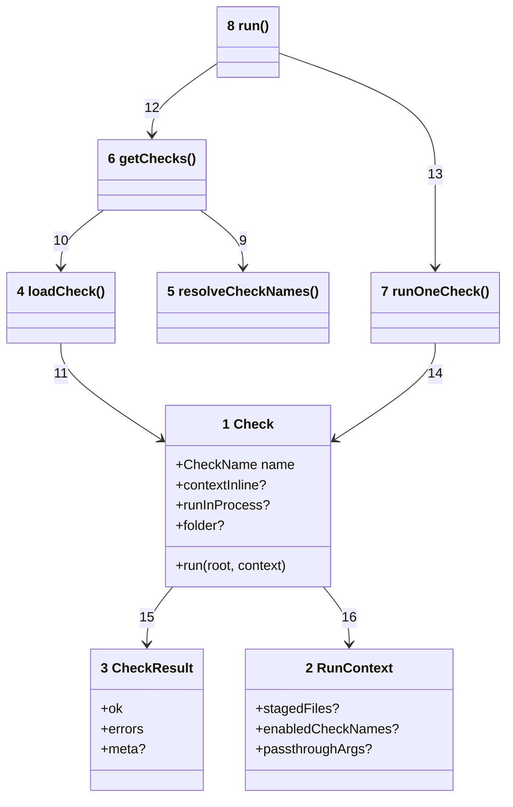
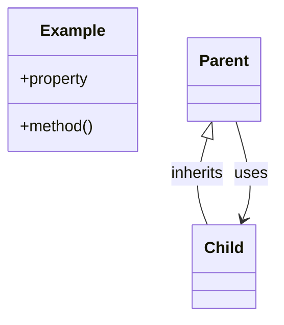

# Code





Numbers on classes and relationships match the callout table.

| #   | Description                                                                       | Why                                                  |
| --- | --------------------------------------------------------------------------------- | ---------------------------------------------------- |
| 1   | Check contract: `name` matches package suffix; `run` returns `CheckResult`.       | Every `@mayjournal/fitness-check-*` default export.  |
| 2   | Per-run context: staged files, enabled names, passthrough args, test hooks.       | Passed to every check; optional overrides for tests. |
| 3   | `{ ok, errors[], meta? }` — files checked count in meta when set.                 | Aggregated into results table.                       |
| 4   | Dynamic import of one check package; validates `default.name`.                    | Throws on missing package or name mismatch.          |
| 5   | Produces ordered deduped name list from config or bundle.                         | Single source for which checks run.                  |
| 6   | Parses argv, loads checks, builds context, handles single-check and path specs.   | `packages/runner/src/runner/run-resolve.ts`.         |
| 7   | Worker thread (default) or in-process when path-loaded / `runInProcess` / vitest. | 5s timeout unless test override.                     |
| 8   | Public API: `run(argv)` — exit 0 or 1.                                            | Called from CLI entry and tests.                     |
| 9   | Full run resolves names before loading each module.                               | Config and bundle consulted once.                    |
| 10  | One import per resolved name.                                                     | Lazy — only installed checks load.                   |
| 11  | Imported module must satisfy `Check` shape.                                       | Runtime validation of plugin contract.               |
| 12  | `runImpl` calls `getChecks` then loops.                                           | Resolve-then-execute pipeline.                       |
| 13  | `collectResults` awaits `runOneCheck` per check.                                  | Sequential execution.                                |
| 14  | Executor invokes `check.run(root, context)`.                                      | Check encapsulates tool calls.                       |
| 15  | Result drives table row and exit code.                                            | Deterministic pass/fail.                             |
| 16  | Context built in resolver from git, argv, loaded checks.                          | Checks stay stateless between runs.                  |

## Monorepo layout

```text
fitness-runner/
  package.json                 workspaces root
  architecture/                C4 docs (this folder)
  packages/
    runner/                    @mayjournal/fitness
    shared/                    @mayjournal/fitness-shared
    checks-bundle/             @mayjournal/fitness-checks
    checks/
      eslint/                  @mayjournal/fitness-check-eslint
      prettier/                … one folder per check package
```

Default run order when `.fitnessrc` omits `checks`: [packages/checks-bundle/src/index.ts](../packages/checks-bundle/src/index.ts).

## Development in this repo

Root `package.json` workspace-deps on `@mayjournal/fitness` and `@mayjournal/fitness-checks`. Scripts delegate to the runner (`npm run fitness`). This repo may omit `.fitnessrc` to exercise the bundle default path.

Build and test: `npm run build -ws`, `npm run test -w @mayjournal/fitness`, `npm run fitness`.
