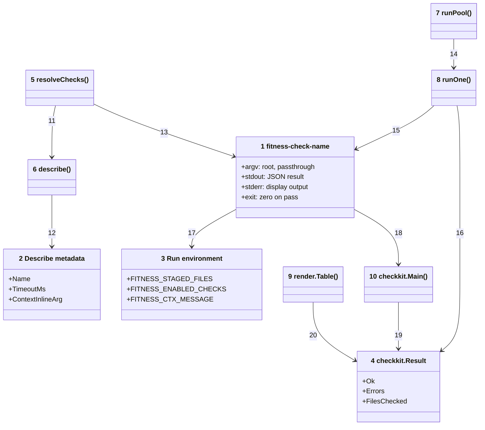
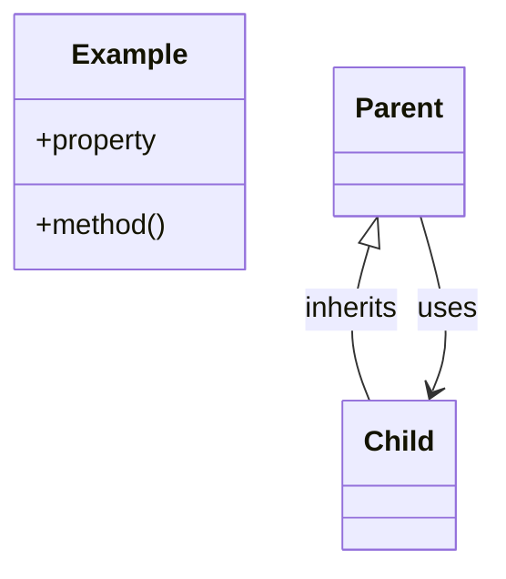

# Code





Numbers on classes and relationships match the callout table.

| #   | Description                                                                                | Why                                                                 |
| --- | ------------------------------------------------------------------------------------------ | ------------------------------------------------------------------- |
| 1   | The check contract: `fitness-check-name --root dir [args…]`, JSON result on stdout.        | Every check — bundled or consumer-local — is one executable.        |
| 2   | Metadata a check prints for `--describe`: name, timeout budget, context-inline argument.   | The runner discovers capabilities with a handshake, not a registry. |
| 3   | Environment the runner exports before dispatch.                                            | Checks stay stateless; context flows one way.                       |
| 4   | `{Ok, Errors, FilesChecked}` — emitted by the check, parsed by the runner.                 | Aggregated into the results table.                                  |
| 5   | Builds the ordered, deduped check list from config or the embedded defaults.               | Single source for which checks run.                                 |
| 6   | Runs `binary --describe` with a two-second budget and group kill.                          | A local script that ignores the flag cannot hang resolution.        |
| 7   | Bounded goroutine pool dispatching in order, collecting outcomes by index.                 | Parallel execution with strictly ordered rendering afterwards.      |
| 8   | Execs one check with `exec.Command` + Setpgid; timeout sends TERM then KILL to the group.  | A hung check's whole child tree dies (5s default budget).           |
| 9   | Renders rows into the bordered table with the totals line.                                 | Deterministic output regardless of completion order.                |
| 10  | Main scaffolding every check binary delegates to: flag parsing, describe, result emission. | Checks implement one Run function; the protocol lives once.         |
| 11  | Resolution asks each resolved binary to describe itself.                                   | Timeouts and inline args ride the same handshake.                   |
| 12  | Describe output parsed as JSON.                                                            | Stdlib all the way down.                                            |
| 13  | Name specs resolve beside the runner, then on PATH; path specs relative to root.           | Filesystem convention replaces module resolution.                   |
| 14  | The pool runs each outcome slot concurrently under a semaphore.                            | CPU-bounded parallelism.                                            |
| 15  | The wrapper invokes the binary with cwd = root and the context env.                        | Check encapsulates its own tool calls.                              |
| 16  | The last non-empty stdout line parses as the Result; crashes synthesize a failure.         | Stray tool noise ahead of the JSON is tolerated.                    |
| 17  | Binaries read context from the environment via checkkit accessors.                         | No IPC; plain env vars work everywhere.                             |
| 18  | Every check main delegates to `checkkit.Main`.                                             | One protocol implementation across 27 binaries.                     |
| 19  | Pass/Fail helpers build the Result the scaffolding emits.                                  | Uniform shapes, always non-nil error arrays.                        |
| 20  | The renderer reads collected results in dispatch order.                                    | Single summary per invocation.                                      |

## Monorepo layout

```text
fitness-runner/
  package.json                 dev tooling + the one npm workspace
  architecture/                C4 docs (this folder)
  go/
    go.mod                     single module, stdlib-only
    cmd/fitness/               runner binary
    cmd/fitness-check-name/    one main + README per check (27 names)
    internal/                  checkkit, walkfs, gitx, mdx, mermaid, spell,
                               clonedetect, vitestconf, mdfilename, render, conf
    bin/                       build output (gitignored)
  packages/shared/             @mayjournal/fitness-shared — tool configs as data

consumer-repo/                 (not in this monorepo)
  .fitnessrc.json              checks: names + optional local executable paths
  fitness/checks/              optional local check executables
```

## Development in this repo

`npm run fitness` compiles `go/bin` (about 300ms warm) and runs the suite this repo gates its own commits on — 21 checks in under two seconds, driven by `.fitnessrc.json`. `npm test` runs `go test ./...`; `npm run test:scripts` covers the node-based repo scripts (publishing, changelog stamping, dictionary generation).
