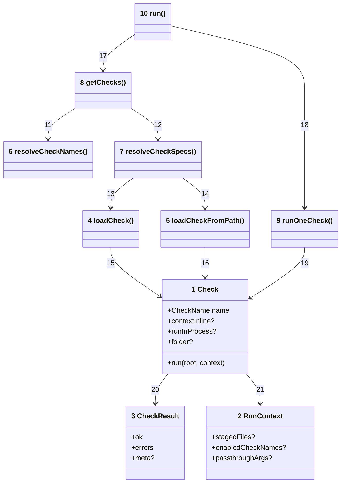
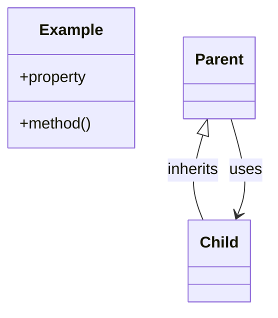

# Code





Numbers on classes and relationships match the callout table.

| #   | Description                                                                                                       | Why                                                     |
| --- | ----------------------------------------------------------------------------------------------------------------- | ------------------------------------------------------- |
| 1   | Check contract: `name` matches package suffix (npm) or module author choice (local); `run` returns `CheckResult`. | Every check module — published or consumer-local.       |
| 2   | Per-run context: staged files, enabled names, passthrough args, test hooks.                                       | Passed to every check; optional overrides for tests.    |
| 3   | `{ ok, errors[], meta? }` — files checked count in meta when set.                                                 | Aggregated into results table.                          |
| 4   | Dynamic import of one check package; validates `default.name`.                                                    | Throws on missing package or name mismatch.             |
| 5   | Dynamic import of a consumer module path; validates `{ name, run }`.                                              | Path specs from config or CLI; marks check path-loaded. |
| 6   | Produces ordered deduped spec list (names and/or paths) from config or bundle.                                    | Single source for which checks run.                     |
| 7   | Loads each spec to a `Check[]`; name specs may skip when package missing.                                         | Config paths fail loud; bundle default is names only.   |
| 8   | Parses argv, resolves specs, builds context, handles single-check mode.                                           | `packages/runner/src/runner/run-resolve.ts`.            |
| 9   | Worker thread (default) or in-process when path-loaded / `runInProcess` / vitest.                                 | 5s timeout unless test override.                        |
| 10  | Public API: `run(argv)` — exit 0 or 1.                                                                            | Called from CLI entry and tests.                        |
| 11  | Full run resolves spec list before loading modules.                                                               | Config and bundle consulted once.                       |
| 12  | One load per resolved spec (name or path).                                                                        | Lazy — only configured checks load.                     |
| 13  | Name spec → npm package import.                                                                                   | Same as today for `@mayjournal/fitness-check-*`.        |
| 14  | Path spec → `import()` relative to project root.                                                                  | Shared with CLI `--check=./…` positional.               |
| 15  | Imported npm module must satisfy `Check` shape.                                                                   | Runtime validation of plugin contract.                  |
| 16  | Imported local module must default-export (or export) a `Check`.                                                  | Same contract as npm packages.                          |
| 17  | `runImpl` calls `getChecks` then loops.                                                                           | Resolve-then-execute pipeline.                          |
| 18  | `collectResults` awaits `runOneCheck` per check.                                                                  | Sequential execution.                                   |
| 19  | Executor invokes `check.run(root, context)`.                                                                      | Check encapsulates tool calls.                          |
| 20  | Result drives table row and exit code.                                                                            | Deterministic pass/fail.                                |
| 21  | Context built in resolver from git, argv, loaded checks.                                                          | Checks stay stateless between runs.                     |

## Monorepo layout

```text
fitness-runner/
  package.json                 workspaces root
  architecture/                C4 docs (this folder)
  packages/
    runner/                    @mayjournal/fitness
    shared/                    @mayjournal/fitness-shared
    checks-bundle/             @mayjournal/fitness-checks
    checks/
      eslint/                  @mayjournal/fitness-check-eslint
      prettier/                … one folder per check package

consumer-repo/                 (not in this monorepo)
  .fitnessrc.js                checks: names + optional ./fitness/*.js paths
  fitness/checks/              optional local check modules
```

Default run order when `.fitnessrc` omits `checks`: [packages/checks-bundle/src/index.ts](../packages/checks-bundle/src/index.ts).

## Development in this repo

Root `package.json` workspace-deps on `@mayjournal/fitness` and `@mayjournal/fitness-checks`. Scripts delegate to the runner (`npm run fitness`). This repo may omit `.fitnessrc` to exercise the bundle default path.

Build and test: `npm run build -ws`, `npm run test -w @mayjournal/fitness`, `npm run fitness`.
