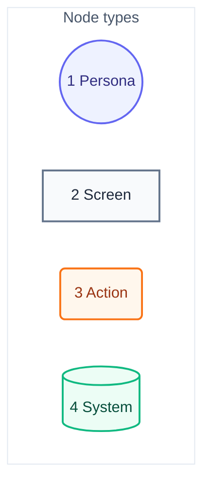
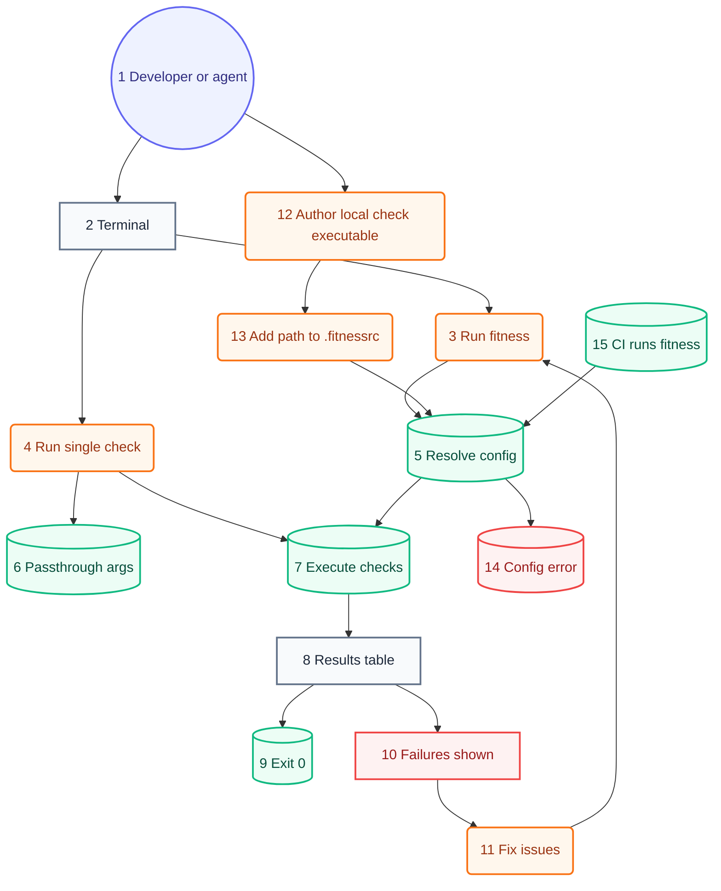

# User Journey

## Legend

Numbers match the callout table. "Screen" is a terminal output state, not a GUI view — this is a CLI.

| #   | Description | Why                                                        |
| --- | ----------- | ---------------------------------------------------------- |
| 1   | Persona     | Developer or AI agent — same CLI, same exit-code contract. |
| 2   | Screen      | What the invoker sees printed to the terminal.             |
| 3   | Action      | A command, flag, or file edit the invoker performs.        |
| 4   | System      | Runner-internal step: resolve, load, execute, exit.        |

## Developer/agent journey

Numbers match the callout table. System context: [01-system-context.md](01-system-context.md). Components: [03-components.md](03-components.md#resolve-check-specs-priority). Code: [04-code.md](04-code.md).

| #   | Description                      | Type    | Why                                                                                                                  |
| --- | -------------------------------- | ------- | -------------------------------------------------------------------------------------------------------------------- |
| 1   | Developer or AI agent.           | Persona | Agent invokes via hook or script; same CLI as a human — no separate agent-only path.                                 |
| 2   | Terminal / shell.                | Screen  | Repo root; the working directory is the app under test, not the runner's own source.                                 |
| 3   | `fitness` or `npm run fitness`.  | Action  | Full-suite run — every session's most common entry point.                                                            |
| 4   | `fitness <name>` / `--check=…`.  | Action  | Single-check mode bypasses list resolution entirely.                                                                 |
| 5   | Resolve check specs.             | System  | `.fitnessrc.json` `checks` (names and/or paths) else the embedded default list; `disabledChecks` filters names only. |
| 6   | Passthrough args forwarded.      | System  | Args after the check spec reach the check unchanged (e.g. `prettier --write .`).                                     |
| 7   | Run loop executes each check.    | System  | Parallel goroutine pool; every check is a subprocess with its own group-kill timeout.                                |
| 8   | Results table printed.           | Screen  | Pass/fail per check, totals, ANSI formatting.                                                                        |
| 9   | Exit 0.                          | System  | All checks passed — deterministic, not LLM-judged.                                                                   |
| 10  | Failures shown in table.         | Screen  | Exit 1; failing check's `errors` printed inline.                                                                     |
| 11  | Fix and rerun.                   | Action  | Developer/agent edits source, returns to #3.                                                                         |
| 12  | Author a local check executable. | Action  | Consumer-repo executable speaking the JSON protocol — a shell script works.                                          |
| 13  | Add its path to `checks`.        | Action  | Path specs (entries containing a separator) opt in explicitly; `disabledChecks` cannot remove them.                  |
| 14  | Missing or invalid path throws.  | System  | Path entries fail loud — explicitly configured, unlike name specs which allow-miss.                                  |
| 15  | CI runs the same command.        | System  | Same `fitness` invocation gates the merge — no CI-only config branch.                                                |
