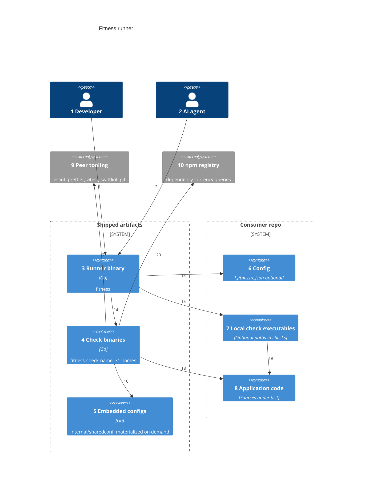
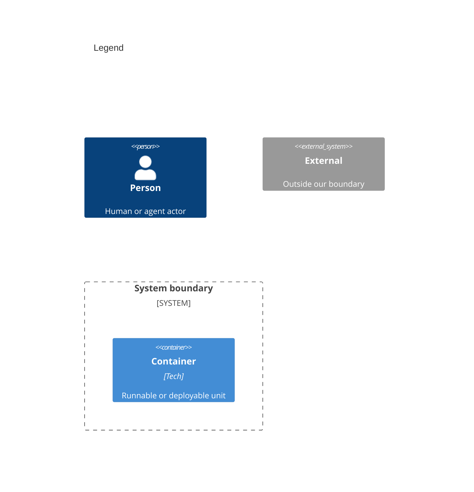

# Containers

Numbers on nodes and arrows match the callout table.

| #   | Description                                                                                      | Why                                                         |
| --- | ------------------------------------------------------------------------------------------------ | ----------------------------------------------------------- |
| 1   | Same actor as system context.                                                                    | All runs start at the runner binary.                        |
| 2   | Same agent actor as system context.                                                              | Agents never link checks — they invoke the CLI.             |
| 3   | `fitness` — argv, spec resolution, describe handshake, parallel pool, results table.             | Single orchestration surface, one static binary.            |
| 4   | One static binary per check name, found beside the runner then on PATH.                          | Plugin model at the artifact level; no in-process registry. |
| 5   | Tool configs embedded in the binaries, materialized to a cache dir on demand.                    | Opinionated defaults; consumer local config wins.           |
| 6   | Optional `.fitnessrc.json` — `checks` (names and/or paths), `disabledChecks`, per-check options. | Override order and subset; paths opt in explicitly.         |
| 7   | Consumer-authored executables (any language) speaking the JSON protocol.                         | Repo-specific rules without publishing anything.            |
| 8   | Files checks lint, format, spell-check, or scan.                                                 | Staged paths from git when available.                       |
| 9   | Tool-wrapper checks exec these when installed; native engines (cspell, jscpd souls) need none.   | Peer tools resolved at runtime, never bundled.              |
| 10  | The dependency-currency check queries the registry over HTTPS directly.                          | No npm binary needed; offline degrades to pass.             |
| 11  | Developer runs the binary from the consumer root.                                                | One front door.                                             |
| 12  | Agent runs the same binary via script or hook.                                                   | Unified enforcement path.                                   |
| 13  | Runner loads `.fitnessrc.json` from the consumer root.                                           | Config lives with the app, not the runner source.           |
| 14  | Runner execs `fitness-check-name --root dir` per resolved name.                                  | Runtime resolution — no static registry in the runner.      |
| 15  | Runner execs local path entries the same way.                                                    | Same execution model as shipped checks.                     |
| 16  | Tool-wrapper checks fall back to the shared configs when the repo has none.                      | Turnkey defaults without local config copies.               |
| 17  | Checks resolve peer binaries from `node_modules/.bin` walking up, then PATH, never npx.          | Missing tools fail with one-line install hints.             |
| 18  | Checks read the consumer tree (staged or full).                                                  | Validation target is always the app repo.                   |
| 19  | Local checks live beside app code; any executable qualifies.                                     | Shell scripts speak the protocol fine.                      |
| 20  | Abbreviated registry metadata, configured registry honored from .npmrc.                          | Currency judgment without shelling to npm.                  |

## Consumer setup

| Setup                                         | Config                      | What runs                                   |
| --------------------------------------------- | --------------------------- | ------------------------------------------- |
| Runner + check binaries on PATH               | None                        | The runner's embedded default list in order |
| Above + `.fitnessrc.json` with `checks`       | Override list               | Your configured order and subset            |
| Above + `checks` mixing names and local paths | Mixed names and executables | Full configured list in order               |
| Above + `disabledChecks` only                 | Exclude names               | Default list minus disabled                 |

`disabledChecks` applies to check names only; local paths are opt-in via explicit `checks` entries and are never removed by it. The cspell and jscpd checks are native engines needing no external tool; prettier, eslint, vitest-coverage-full, and swiftlint exec the real tool and fail clearly when it is missing.

Install and usage: [README.md](../../README.md). Artifacts ship through GitHub Releases and the public Go module proxy — see the README's Distribution section.
