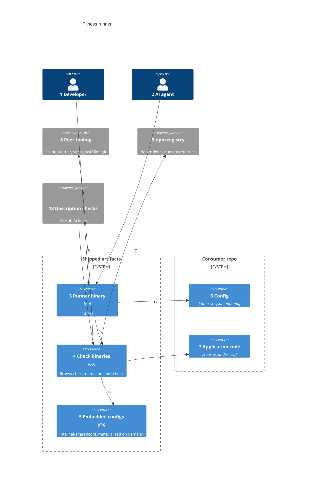
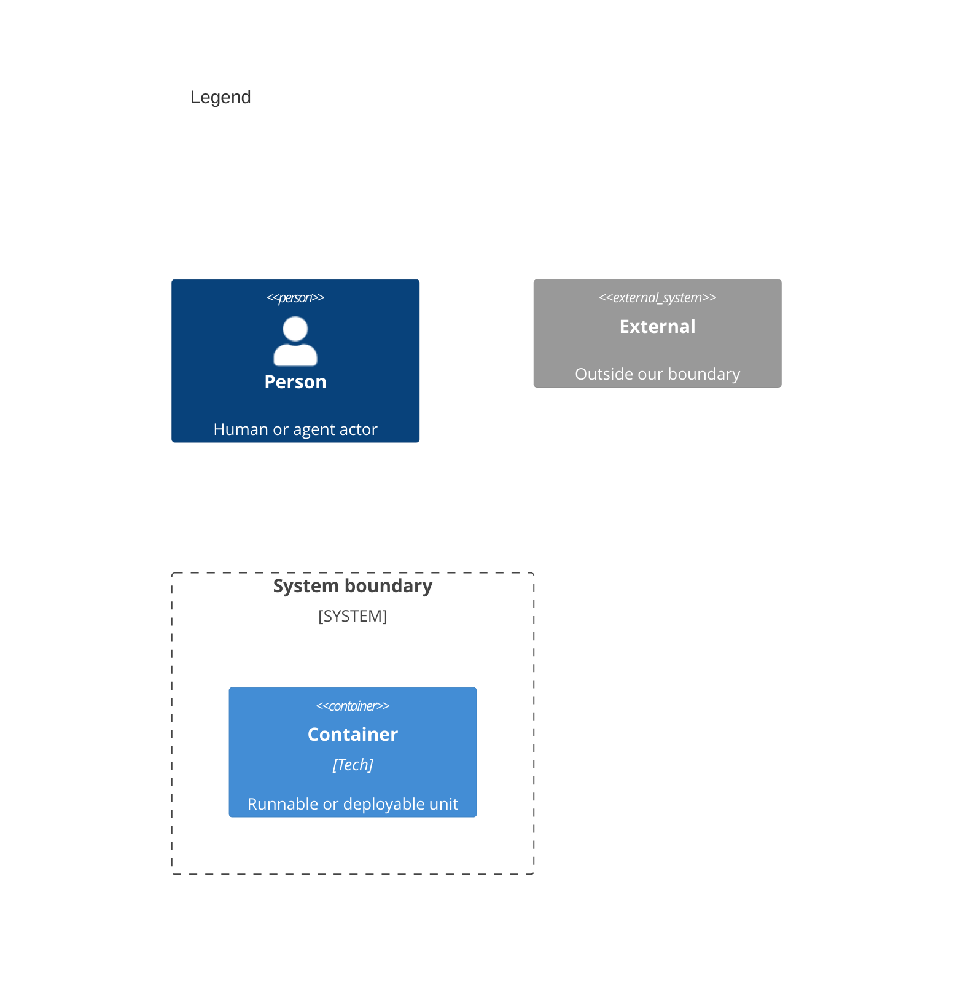

# Containers

```mermaid
C4Container
    title Fitness runner

    Person(developer, "1 Developer")
    Person(agent, "2 AI agent")

    System_Boundary(ship, "Shipped artifacts") {
        Container(cli, "3 Runner binary", "Go", "fitness")
        Container(checks, "4 Check binaries", "Go", "fitness-check-name, one per check")
        Container(shared, "5 Embedded configs", "Go", "internal/sharedconf, materialized on demand")
    }

    System_Boundary(consumer, "Consumer repo") {
        Container(rc, "6 Config", ".fitnessrc.json optional")
        Container(code, "7 Application code", "Sources under test")
    }

    System_Ext(tools, "8 Peer tooling", "eslint, prettier, vitest, swiftlint, git")
    System_Ext(registry, "9 npm registry", "dependency-currency queries")
    System_Ext(ci, "18 Description checks", "GitHub Actions", "plan-check and pr-check")

    Rel(developer, cli, "10")
    Rel(agent, cli, "11")
    Rel(cli, rc, "12")
    Rel(cli, checks, "13")
    Rel(checks, shared, "14")
    Rel(checks, tools, "15")
    Rel(checks, code, "16")
    Rel(checks, registry, "17")
    Rel(ci, checks, "19")
```

```mermaid
C4Container
    title Legend

    Person(p, "Person", "Human or agent actor")
    System_Boundary(b, "System boundary") {
        Container(c, "Container", "Tech", "Runnable or deployable unit")
    }
    System_Ext(e, "External", "Outside our boundary")
```

Numbers on nodes and arrows match the callout table.

| #   | Description                                                                                      | Why                                                         |
| --- | ------------------------------------------------------------------------------------------------ | ----------------------------------------------------------- |
| 1   | Same actor as system context.                                                                    | All runs start at the runner binary.                        |
| 2   | Same agent actor as system context.                                                              | Agents never link checks — they invoke the CLI.             |
| 3   | `fitness` — argv, spec resolution, describe handshake, parallel pool, results table.             | Single orchestration surface, one static binary.            |
| 4   | One static binary per check name, found beside the runner then on PATH.                          | Plugin model at the artifact level; no in-process registry. |
| 5   | Tool configs embedded in the binaries, materialized to a cache dir on demand.                    | Opinionated defaults; consumer local config wins.           |
| 6   | Optional `.fitnessrc.json` — exceptions only: per-check options.                                 | Every check runs on every tracked file; no path is ignored. |
| 7   | Files checks lint, format, spell-check, or scan.                                                 | Staged paths from git when available.                       |
| 8   | Tool-wrapper checks exec these when installed; native engines (cspell, jscpd souls) need none.   | Peer tools resolved at runtime, never bundled.              |
| 9   | The dependency-currency check queries the registry over HTTPS directly.                          | No npm binary needed; offline degrades to pass.             |
| 10  | Developer runs the binary from the consumer root.                                                | One front door.                                             |
| 11  | Agent runs the same binary via script or hook.                                                   | Unified enforcement path.                                   |
| 12  | Runner loads `.fitnessrc.json` from the consumer root.                                           | Config lives with the app, not the runner source.           |
| 13  | Runner execs `fitness-check-name --root dir` per resolved name.                                  | Runtime resolution — no static registry in the runner.      |
| 14  | Tool-wrapper checks fall back to the shared configs when the repo has none.                      | Turnkey defaults without local config copies.               |
| 15  | Checks resolve peer binaries from `node_modules/.bin` walking up, then PATH, never npx.          | Missing tools fail with one-line install hints.             |
| 16  | Checks read the consumer tree (staged or full).                                                  | Validation target is always the app repo.                   |
| 17  | Abbreviated registry metadata, configured registry honored from .npmrc.                          | Currency judgment without shelling to npm.                  |
| 18  | The `plan-check` and `pr-check` GitHub Actions workflows lint an Issue or PR description.         | Descriptions held to the same bar as files.                 |
| 19  | `fitness pr-check` and `plan-check` exec each check with `--body-file`, reusing body mode.       | One rule engine for files and descriptions.                 |

## Consumer setup

| Setup                           | Config         | What runs                                         |
| ------------------------------- | -------------- | ------------------------------------------------- |
| Runner + check binaries on PATH | None           | Every check; one that does not apply passes clean |
| Above + per-check options       | Tune one check | Every check, the tuned one with your options      |

There is no list of checks to keep in sync: each check detects whether its language, tool, config, or input is present. A leftover `checks` key is ignored with a one-line warning. The cspell and jscpd checks are native engines needing no external tool. Prettier, eslint, vitest-coverage-full, and swiftlint exec the real tool and fail clearly when it is missing.

Install and usage: [README.md](../../README.md). Artifacts ship through GitHub Releases and the public Go module proxy — see the README's Distribution section.
