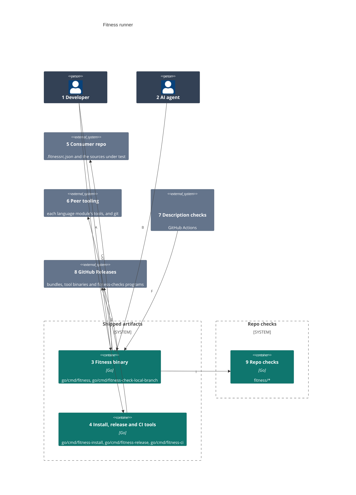
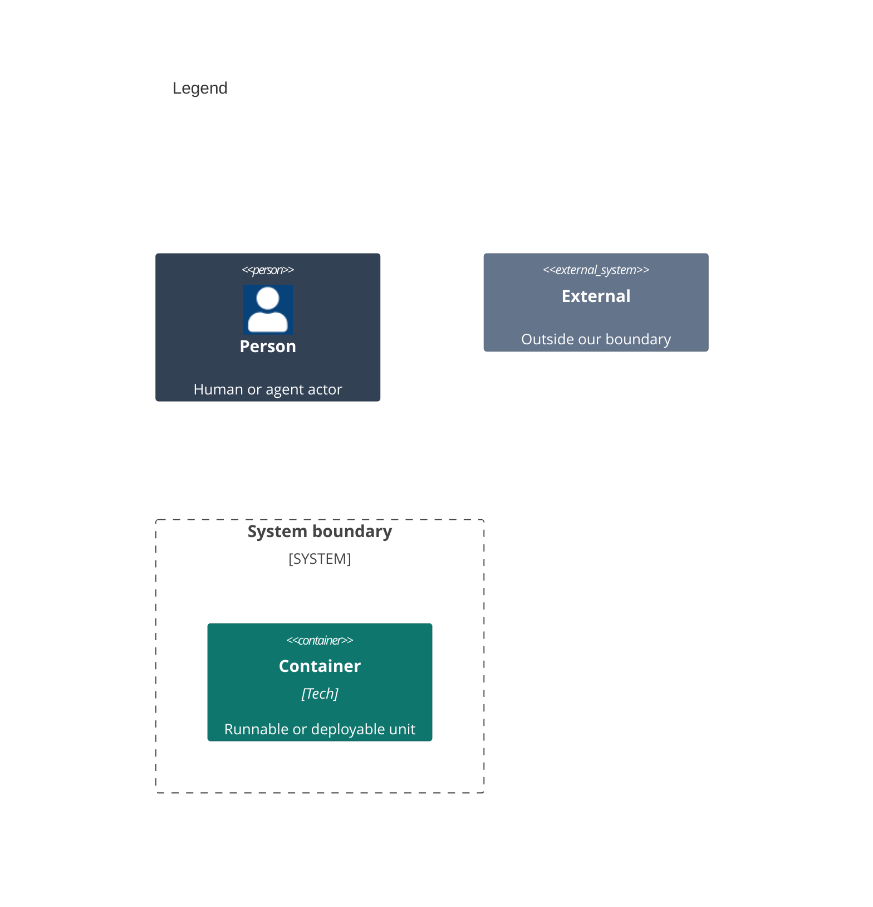

# Containers

```mermaid
C4Container
    title Fitness runner

    Person(developer, "1 Developer")
    Person(agent, "2 AI agent")

    System_Boundary(ship, "Shipped artifacts") {
        Container(cli, "3 Fitness binary", "Go", "go/cmd/fitness, go/cmd/fitness-check-local-branch")
        Container(tools, "4 Install, release and CI tools", "Go", "go/cmd/fitness-install, go/cmd/fitness-release, go/cmd/fitness-ci")
    }

    System_Boundary(own, "Repo checks") {
        Container(repo, "9 Repo checks", "Go", "fitness/*")
    }

    System_Ext(consumer, "5 Consumer repo", ".fitnessrc.json and the sources under test")
    System_Ext(peers, "6 Peer tooling", "each language module's tools, and git")
    System_Ext(ci, "7 Description checks", "GitHub Actions", "issue-check and pr-check")
    System_Ext(releases, "8 GitHub Releases", "bundles, tool binaries and fitness-checks programs")

    Rel(developer, cli, "A")
    Rel(agent, cli, "B")
    Rel(cli, consumer, "C")
    Rel(cli, peers, "D")
    Rel(cli, releases, "E")
    Rel(ci, cli, "F")
    Rel(developer, tools, "G")
    Rel(tools, releases, "H")
    Rel(cli, repo, "I")

    UpdateElementStyle(developer, $bgColor="#334155", $borderColor="#1e293b", $fontColor="#ffffff")
    UpdateElementStyle(agent, $bgColor="#334155", $borderColor="#1e293b", $fontColor="#ffffff")
    UpdateElementStyle(cli, $bgColor="#0f766e", $borderColor="#115e59", $fontColor="#ffffff")
    UpdateElementStyle(tools, $bgColor="#0f766e", $borderColor="#115e59", $fontColor="#ffffff")
    UpdateElementStyle(repo, $bgColor="#0f766e", $borderColor="#115e59", $fontColor="#ffffff")
    UpdateElementStyle(consumer, $bgColor="#64748b", $borderColor="#475569", $fontColor="#ffffff")
    UpdateElementStyle(peers, $bgColor="#64748b", $borderColor="#475569", $fontColor="#ffffff")
    UpdateElementStyle(ci, $bgColor="#64748b", $borderColor="#475569", $fontColor="#ffffff")
    UpdateElementStyle(releases, $bgColor="#64748b", $borderColor="#475569", $fontColor="#ffffff")
```

```mermaid
C4Container
    title Legend

    Person(p, "Person", "Human or agent actor")
    System_Boundary(b, "System boundary") {
        Container(c, "Container", "Tech", "Runnable or deployable unit")
    }
    System_Ext(e, "External", "Outside our boundary")

    UpdateElementStyle(p, $bgColor="#334155", $borderColor="#1e293b", $fontColor="#ffffff")
    UpdateElementStyle(c, $bgColor="#0f766e", $borderColor="#115e59", $fontColor="#ffffff")
    UpdateElementStyle(e, $bgColor="#64748b", $borderColor="#475569", $fontColor="#ffffff")
```

Numbers on nodes and letters on arrows match the callout table. Each container names the commands it is built from; a trailing `*` names every sibling folder.

| #   | Description                                                                                      | Why                                                         |
| --- | ------------------------------------------------------------------------------------------------ | ----------------------------------------------------------- |
| 1   | Same actor as system context.                                                                    | All runs start at the fitness binary.                       |
| 2   | Same agent actor as system context.                                                              | Agents never link checks — they invoke the CLI.             |
| 3   | `fitness` — the runner and `local-branch`. It runs each installed fitness-checks program as its own process. | The engine ships alone; checks still cannot share state. |
| 4   | The installer, the release tool, and `fitness-ci`, which runs the workflow steps.                | Shipped beside the bundle or built by CI; not part of any run. |
| 5   | Optional `.fitnessrc.json` with per-check options, and the files checks lint, format, or scan.   | Every check runs on every tracked file; no path is ignored. |
| 6   | Installed checks exec these, the way each language module finds them.                            | Peer tools resolved at runtime, never bundled.              |
| 7   | The `issue-check` and `pr-check` GitHub Actions workflows lint an Issue or PR description.       | Descriptions held to the same bar as files.                 |
| 8   | Release bundles, tool binaries, and each fitness-checks program, one archive per platform.        | Artifacts ship through GitHub Releases and the Go proxy.    |
| 9   | This repo's own checks in `fitness/`, each a Go program that fitness builds, or any executable. | Each decision holds while its check passes, as ADR 0012 decides. |
| A   | Developer runs the binary from the consumer root.                                                | One front door.                                             |
| B   | Agent runs the same binary via script or hook.                                                   | Unified enforcement path.                                   |
| C   | The runner loads `.fitnessrc.json`, and each check process reads the tree, staged or full.        | Config and validation target live with the app.             |
| D   | Checks resolve peer binaries the way their language module finds tools, then PATH.               | Missing tools fail with one-line install hints.             |
| E   | The runner fetches each check `checkVersions` pins and no install handed it, verified by checksum. | `go install` then `fitness` works on a clean machine.       |
| F   | `fitness pr-check` and `issue-check` run each check with `--body-file`, reusing body mode.       | One rule engine for files and descriptions.                 |
| G   | Developer runs `fitness-install`; the pre-commit hook runs the suite.                            | One documented one-liner installs or runs the suite.        |
| H   | `fitness-release` builds and publishes the bundles.                                              | Release and install share one versioned artifact set.       |
| I   | The runner finds each check folder, builds a Go one into its cache, and runs it as its own process. | Repo checks speak the protocol installed checks speak. |

## Consumer setup

| Setup                           | Config         | What runs                                         |
| ------------------------------- | -------------- | ------------------------------------------------- |
| Fitness binary on PATH          | None           | Every check; one that does not apply passes clean |
| Above + per-check options       | Tune one check | Every check, the tuned one with your options      |

There is no list of checks to keep in sync: each check detects whether its language, tool, config, or input is present. A leftover `checks` key is ignored with a one-line warning.

Install and usage: [README.md](../../README.md). Artifacts ship through GitHub Releases and the public Go module proxy — see the README's Distribution section.
