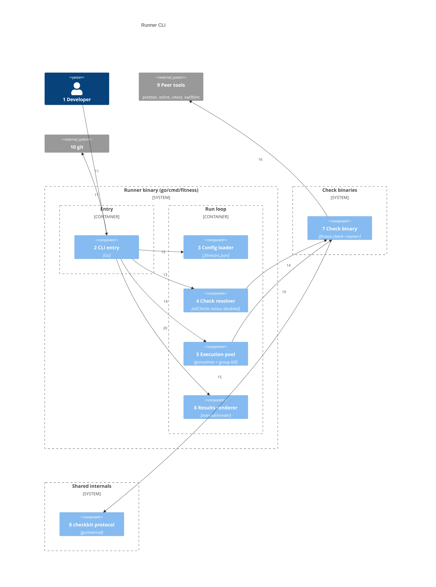
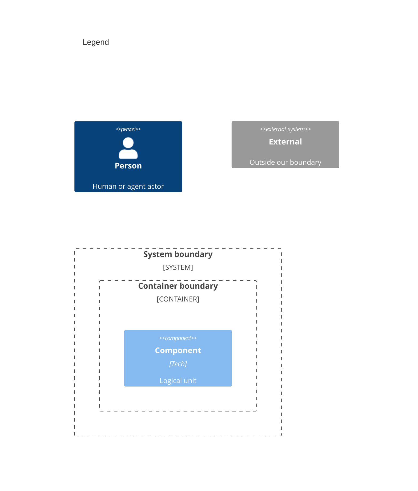

# Components

Numbers on nodes and arrows match the callout table.

| #   | Description                                                                                             | Why                                                         |
| --- | ------------------------------------------------------------------------------------------------------- | ----------------------------------------------------------- |
| 1   | Developer or agent invokes `fitness`.                                                                   | Same entry as system context.                               |
| 2   | `go/cmd/fitness/main.go` — routes the subcommands, else argv, resolve, execute, render.                 | No build step, no interpreter startup.                      |
| 3   | Loads `.fitnessrc.json` (stdlib encoding/json); a lone legacy JS/TS config earns a migration hint.      | Config a compiled runner can parse anywhere.                |
| 4   | Ordered check list: the CLI name, else the embedded `allChecks` list.                                   | One place for check resolution (single name or full list).  |
| 5   | Bounded goroutine pool with per-check timeouts; expiry kills the check's whole process group.           | Parallelism bounds wall-clock at the slowest check.         |
| 6   | Renders the results table + totals line from collected outcomes, in dispatch order.                     | User-visible pass/fail summary.                             |
| 7   | One static binary per check name, discovered beside the runner then on PATH.                            | Plugin model at the artifact level; no registry.            |
| 8   | `checkkit` defines the protocol types and main scaffolding; walker, git, markdown, render helpers.      | One implementation shared by every check binary.            |
| 9   | Tool-wrapper checks exec the real peer tool from `node_modules/.bin` (walking up) then PATH, never npx. | Orchestration, not reimplementation.                        |
| 10  | `git diff --cached --name-only` for staged file context.                                                | Pre-commit and partial runs.                                |
| 11  | User-facing invocation.                                                                                 | Sole human entry point; all else is internal wiring.        |
| 12  | Entry loads config before argv resolution.                                                              | `.fitnessrc.json` drives order, subset, and options.        |
| 13  | Entry delegates to the resolver first.                                                                  | Resolve before execute.                                     |
| 14  | Resolver maps a name to the `fitness-check-<name>` binary and collects its `--describe` metadata.       | Timeout and context-inline metadata without header parsing. |
| 15  | Check binaries build on checkkit for protocol emit and env context.                                     | Contract every check satisfies.                             |
| 16  | Tool wrappers exec their peer binary and parse its output.                                              | The check owns tool invocation and judgment.                |
| 17  | Runner exports `FITNESS_STAGED_FILES` before dispatch.                                                  | Checks receive consistent context.                          |
| 18  | Run loop dispatches each check to the pool.                                                             | Ordered dispatch; buffered, ordered output.                 |
| 19  | Pool execs the binary with `--root`, env context, stdout JSON captured.                                 | One execution model for every check.                        |
| 20  | Run loop prints the table after all checks finish.                                                      | Single summary per invocation.                              |

## Resolve check specs (priority)

`go/cmd/fitness` produces an ordered name list, then resolves each name to `fitness-check-<name>` beside the runner, then on PATH:

1. A CLI name (`fitness prettier`) — run only that built-in check; an unknown name is an error.
2. Otherwise — the embedded `allChecks` list, in order. A missing binary for a listed check fails the run.

Every check runs in every repo and passes clean with zero files when it does not apply. A leftover `checks` key in `.fitnessrc.json` is ignored with a one-line stderr warning.

Single-check mode bypasses the list. Passthrough args after the spec reach the check. A check whose `--describe` declares a context-inline argument has that value extracted into the environment and stripped from passthrough. The commit checks declare `--message`.

## Run context (environment)

| Variable                 | Source                                      |
| ------------------------ | ------------------------------------------- |
| `FITNESS_CHECK_NAME`     | resolved name of the running check          |
| `FITNESS_ENABLED_CHECKS` | names in this run, newline-separated        |
| `FITNESS_STAGED_FILES`   | git staged paths (node_modules stripped)    |
| `FITNESS_CTX_MESSAGE`    | `--message` value for context-inline checks |

Built by the runner before dispatch — not a separate registry.

## Body mode

Check binaries also accept a document instead of a file tree. Given `--body-file`, `bodycheck.RunDoc` runs a check's per-document rule on that body, with config from `--root`. The `fitness plan-check` and `fitness pr-check` subcommands use this to lint Issue and PR descriptions.

An explicit `--body-file` is the only trigger, so a normal file-walking run is never affected. The prose, markdown, and mermaid checks opt in; a cross-file check like `mermaid-level-bleed` does not.

## Subcommands

Before the run loop, the CLI entry routes a few subcommands. Each one lets a git hook or workflow step shrink to one line, while the logic stays in tested Go.

| Subcommand            | Does                                                                                  | Why                                                   |
| --------------------- | ------------------------------------------------------------------------------------- | ----------------------------------------------------- |
| `fitness init`        | Writes the embedded hook shims to `.githooks` and sets `core.hooksPath`.              | A repo pulls its hooks by version, never copies them. |
| `fitness hook <name>` | Runs the commit-msg, pre-commit, or pre-push logic the shims call.                    | Hook logic lives in one place, not in each repo.      |
| `fitness pr-check`    | Reads the Actions event, then checks a PR's title and body with the body-mode checks. | The PR check workflows run one step.                  |
| `fitness plan-check`  | Checks a Plan issue's body, then comments the verdict once per body version.          | The plan check workflows run one step.                |
| `fitness close-check` | Reopens an issue closed as completed with unchecked items, and comments once.         | The close check workflows run one step.               |

The three workflow subcommands reach GitHub through the `gh` CLI, like the pre-push hook.
