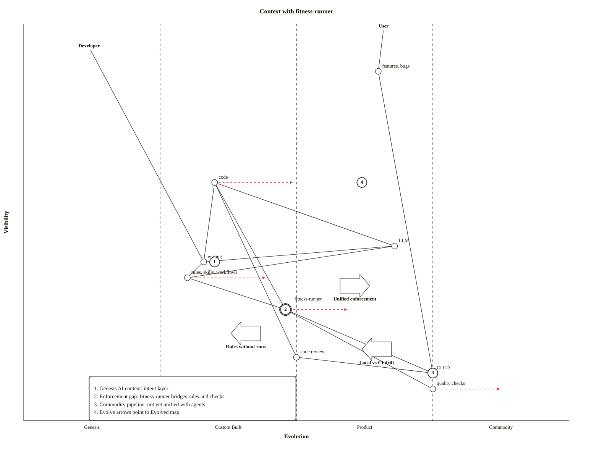

# Wardley map

Context layer for AI-assisted development. Requires Mermaid 11.14+ (`wardley-beta`).

Coordinates are `[visibility, evolution]`: visibility 0 = infrastructure (bottom), 1 = user-facing (top); evolution 0 = genesis (left), 1 = commodity (right). Strategic callouts use numbered annotations; accelerators and deaccelerators show forces pushing evolution right or resisting it.

## Context

```mermaid
wardley-beta
  title Context
  size [1200, 900]

  annotations [0.10, 0.12]

  anchor User [0.99, 0.66]
  anchor Developer [0.94, 0.12]

  component "features, bugs" [0.88, 0.65]
  component code [0.60, 0.35]
  component "rules, skills, workflows" [0.36, 0.30]
  component writing [0.40, 0.33]
  component LLM [0.44, 0.68]
  component "code review" [0.16, 0.50]
  component CI CD [0.12, 0.75]
  component "quality checks" [0.08, 0.75]

  annotation 1,[0.40, 0.35] "Genesis AI context: rules, LLM, writing"
  annotation 2,[0.60, 0.35] "Custom middle: code, review"
  annotation 3,[0.12, 0.75] "Commodity pipeline: CI CD, quality checks"

  deaccelerator "Enforcement disconnect" [0.22, 0.52]
  accelerator "AI adoption" [0.48, 0.22]

  Developer -> writing
  writing -> code
  writing -> "rules, skills, workflows"
  code -> "code review"
  LLM -> code
  "code review" -> CI CD
  CI CD -> "quality checks"
  CI CD -> "features, bugs"
  writing -> LLM
  LLM -> "rules, skills, workflows"

  User -> "features, bugs"
```

## Context with fitness-runner



## Evolved

```mermaid
wardley-beta
  title Evolved
  size [1200, 900]

  annotations [0.10, 0.12]

  anchor User [0.99, 0.66]
  anchor Developer [0.94, 0.12]

  component "features, bugs" [0.88, 0.65]
  component code [0.60, 0.50]
  component "rules, skills, workflows" [0.36, 0.45]
  component writing [0.40, 0.33]
  component LLM [0.44, 0.68]
  component fitness-runner [0.28, 0.60] (build)
  component "code review" [0.16, 0.50]
  component CI CD [0.12, 0.75]
  component "fitness checks" [0.08, 0.88]

  annotation 1,[0.36, 0.45] "Rules matured: enforceable product"
  annotation 2,[0.28, 0.60] "Runner standardized: check contract"
  annotation 3,[0.08, 0.88] "Quality checks became fitness checks"
  annotation 4,[0.60, 0.50] "Code: consistent product-stage patterns"

  accelerator "One check set everywhere" [0.20, 0.85]

  Developer -> writing
  writing -> code
  writing -> "rules, skills, workflows"
  code -> "code review"
  code -> fitness-runner
  LLM -> code
  "code review" -> CI CD
  "rules, skills, workflows" -> fitness-runner
  CI CD -> fitness-runner
  fitness-runner -> "fitness checks"
  CI CD -> "features, bugs"
  writing -> LLM
  LLM -> "rules, skills, workflows"

  User -> "features, bugs"
```

## Before AI

```mermaid
wardley-beta
  title Before AI
  size [1200, 900]

  annotations [0.10, 0.12]

  anchor User [0.99, 0.66]
  anchor Developer [0.94, 0.12]

  component "features, bugs" [0.88, 0.65]
  component code [0.58, 0.35]
  component writing [0.42, 0.33]
  component "code review" [0.16, 0.50]
  component CI CD [0.12, 0.75]
  component "quality checks" [0.08, 0.75]

  annotation 1,[0.42, 0.33] "No AI context layer: writing is typing code"
  annotation 2,[0.12, 0.75] "Closed chain: review, CI CD, checks"
  annotation 3,[0.58, 0.35] "No enforcement gap"

  Developer -> writing
  writing -> code
  code -> "code review"
  "code review" -> CI CD
  CI CD -> "quality checks"
  CI CD -> "features, bugs"

  User -> "features, bugs"
```
