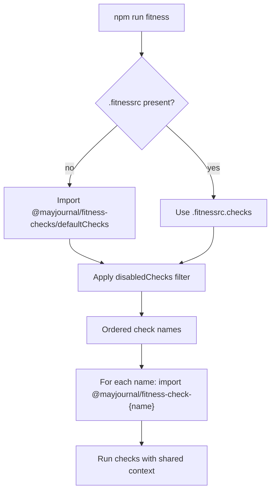

# Plan: Split runner from check packages

Split this repo into an npm workspaces monorepo:

- `@mayjournal/fitness` — runner only (CLI, orchestration, types)
- `@mayjournal/fitness-check-{name}` — one npm package per check (12 total)
- `@mayjournal/fitness-shared` — helpers used by checks (not installed by consumers directly)
- `@mayjournal/fitness-checks` — optional bundle; installs all checks and exports the default run list

Status: steps 1–6 and 6b complete on branch `feat/split-runner-check-packages`. Next: step 7 (repo setup, CI, publish, docs).

## Runtime (simplified)

One resolution function. No registry. No silent skips.

`disabledChecks`: Filter in `resolveCheckNames` after base list resolution (`.fitnessrc` `checks` or bundle `defaultChecks`).



### Resolve check names (priority order)

1. `.fitnessrc` present with `checks` → use that list (order preserved, deduped).
2. No `.fitnessrc` (or no `checks`) → import `defaultChecks` from `@mayjournal/fitness-checks` (ordered `CheckName[]`).
3. `disabledChecks` in config → exclude those names from the resolved list (whether from step 1 or 2).
4. Neither step 1 nor 2 available → fail with a clear message: install `@mayjournal/fitness-checks` or add `.fitnessrc` with `checks` and install matching `@mayjournal/fitness-check-*` packages.

One resolved list, one load loop (no separate registry).

### Load and run

For each resolved name:

```ts
const pkg = `@mayjournal/fitness-check-${name}`;
const check = (await import(resolveFrom(root, pkg))).default;
// error if missing package or default.name !== name
await check.run(root, context);
```

Single-check CLI unchanged: `npx fitness eslint` or `--check=./custom.mjs` bypasses the list above.

### Context simplification

Drop registry-derived context. Build from loaded checks only:

| Field                                  | Source                                   |
| -------------------------------------- | ---------------------------------------- |
| `enabledCheckNames`                    | names in this run                        |
| `registeredCheckNames`                 | same as enabled (no separate registry)   |
| `checkFolderByName`                    | from each loaded `Check.folder` when set |
| `stagedFiles`, `passthroughArgs`, etc. | unchanged                                |

### Consumer flows

| Setup                                                | Config needed              | What runs                  |
| ---------------------------------------------------- | -------------------------- | -------------------------- |
| `@mayjournal/fitness` + `@mayjournal/fitness-checks` | None                       | Bundle’s `defaultChecks`   |
| Above + `.fitnessrc`                                 | Optional `checks` override | Your `checks` list         |
| Above + `.fitnessrc`                                 | `disabledChecks` only      | Bundle list minus excluded |
| `@mayjournal/fitness` + à la carte check packages    | Required `.fitnessrc`      | Listed checks only         |

Simplest path: install runner + bundle → `npm run fitness`. Zero config.

Custom path: `.fitnessrc` overrides order/subset; bundle still satisfies installs.

## Decisions

| Topic                        | Choice                                                                              |
| ---------------------------- | ----------------------------------------------------------------------------------- |
| Runtime default              | `@mayjournal/fitness-checks` exports `defaultChecks`; used when `.fitnessrc` absent |
| Runtime override             | `.fitnessrc.checks` optional; when set, replaces default list                       |
| Subset without full override | `.fitnessrc.disabledChecks` excludes names from resolved list (checks or bundle)    |
| À la carte                   | No bundle → `.fitnessrc` required                                                   |
| Layout                       | `packages/checks/*` (nested)                                                        |
| Shared                       | `@mayjournal/fitness-shared` published separately                                   |
| Publishing                   | Lockstep timestamp version (`0.1.0-yyyy.mm.dd.HHMM`)                                |
| Config files                 | Ship with the check that uses them                                                  |

## Repo layout

```
fitness-runner/
  package.json
  packages/
    runner/                    @mayjournal/fitness
    shared/                    @mayjournal/fitness-shared
    checks-bundle/               @mayjournal/fitness-checks  (+ defaultChecks export)
    checks/
      read-repo-first/
      changelog/
      …
```

Workspaces: `["packages/runner", "packages/shared", "packages/checks-bundle", "packages/checks/*"]`

## Package contracts

Check package (`@mayjournal/fitness-check-{name}`)

- `export default check` where `check.name === {name}`
- Depends on `@mayjournal/fitness`, `@mayjournal/fitness-shared`, plus its tooling
- Ships its config files when applicable

Bundle (`@mayjournal/fitness-checks`)

- Depends on all 12 check packages (install-only convenience)
- Exports runtime default list:

```ts
// packages/checks-bundle/src/index.ts
export const defaultChecks = [
  'read-repo-first',
  'changelog',
  // … full ordered list
] as const;
```

Also export as `@mayjournal/fitness-checks/defaultChecks` subpath for runner import.

Runner (`@mayjournal/fitness`)

- Exports `.` only (CLI + types)
- `resolveCheckNames(root)` → string[] via rules above
- `loadCheck(name, root)` → dynamic import

## Check inventory

| Package                                             | `Check.name`              |
| --------------------------------------------------- | ------------------------- |
| `@mayjournal/fitness-check-read-repo-first`         | `read-repo-first`         |
| `@mayjournal/fitness-check-changelog`               | `changelog`               |
| `@mayjournal/fitness-check-changelog-updated`       | `changelog-updated`       |
| `@mayjournal/fitness-check-cspell`                  | `cspell`                  |
| `@mayjournal/fitness-check-eslint`                  | `eslint`                  |
| `@mayjournal/fitness-check-markdown-no-bold-italic` | `markdown-no-bold-italic` |
| `@mayjournal/fitness-check-prettier`                | `prettier`                |
| `@mayjournal/fitness-check-node-version`            | `node-version`            |
| `@mayjournal/fitness-check-markdown-front-matter`   | `markdown-front-matter`   |
| `@mayjournal/fitness-check-semantic-commit`         | `semantic-commit`         |
| `@mayjournal/fitness-check-vitest-coverage-exclude` | `vitest-coverage-exclude` |
| `@mayjournal/fitness-check-vitest-coverage-full`    | `vitest-coverage-full`    |

## This repo setup

```json
{
  "devDependencies": {
    "@mayjournal/fitness": "workspace:*",
    "@mayjournal/fitness-checks": "workspace:*"
  },
  "scripts": { "fitness": "fitness" }
}
```

This repo may omit `.fitnessrc` to prove the bundle default path, or keep one to test overrides.

## Publish and CI

- CI: `npm ci` → `npm run build -ws` → `npm run test -ws` → `npm run fitness`
- Publish: `npm publish -ws --access restricted`
- Trusted publishing: register each package on npm
- Versions: lockstep across workspaces

## Consumer migration

Minimal (zero config):

```json
{
  "dependencies": {
    "@mayjournal/fitness": "...",
    "@mayjournal/fitness-checks": "..."
  },
  "scripts": { "fitness": "fitness" }
}
```

Override subset/order:

```ts
// .fitnessrc.ts — optional
export default {
  checks: ['eslint', 'prettier', 'semantic-commit'],
};
```

Exclude from bundle default without overriding full list:

```ts
// .fitnessrc.ts — optional (after step 6b)
export default {
  disabledChecks: ['cspell'],
};
```

## Implementation order

### Done (steps 1–6)

1. Scaffold workspaces ✅
2. Move shared utils + configs → `packages/shared` ✅
3. Runner (`@mayjournal/fitness`) — move orchestration into `packages/runner`, own build/tsconfig/dist, get `npm run fitness` green; checks still import from `src/checks/` temporarily ✅
4. Move checks → `packages/checks/*` (one package per check, with configs) ✅
5. Bundle: dependencies + `defaultChecks` export ✅
6. Runner: `resolveCheckNames` + dynamic loader + simplified context (no static registry; runner has no check deps) ✅

6b. Restore `disabledChecks` ✅

- `disabledChecks?: string[]` on `FitnessConfig` in `@mayjournal/fitness-shared` (runner types re-export)
- Filter in `resolveCheckNames` after base list from `.fitnessrc` `checks` or bundle `defaultChecks`
- Tests in `packages/runner` (`load-check.test.ts`, `run.test.ts`)

### Next: Step 7 — This repo setup, CI, publish, docs

- 7a CI — expand `.github/workflows/ci.yml`: `build -ws`, `test -ws` (or key packages), `fitness`; not runner-only ✅
- 7b Publish — expand `publish.yml` and root `publish:ci` to npm publish all packages (runner, shared, bundle, 12 checks); lockstep versions; `publishConfig` on each package ✅
- 7c Docs — update `.cursor/rules/fitness-checks.mdc` (`packages/checks/*` not `src/checks`); trim stale plan refs; CHANGELOG for monorepo split; consumer migration in README ✅
- 7d Release — PR https://github.com/may-journal/fitness-runner/pull/12; register npm packages for trusted publishing (manual note) ✅

## Risks

- Breaking change for current `@mayjournal/fitness`-only consumers
- Bundle becomes load-bearing — must stay published and version-synced with check packages
- `CheckName` type — keep in runner for typed `.fitnessrc`; bundle’s `defaultChecks` satisfies it
